# Chinabase CMS 使用者手冊

**版本：** 1.0  
**日期：** 2026-03-10  
**網站：** https://chinabase.hlhk.net/  
**CMS 入口：** https://chinabase.hlhk.net/cms/  
**適用帳號：** user1

---

## 目錄

1. [登入系統](#1-登入系統)
2. [產品管理 — 產品](#2-產品管理--產品)
3. [產品管理 — 產品分類](#3-產品管理--產品分類)
4. [產品管理 — 產品文件分類](#4-產品管理--產品文件分類)
5. [產品管理 — 產品文件](#5-產品管理--產品文件)
6. [內容管理 — 最新消息](#6-內容管理--最新消息)
7. [內容管理 — 誠聘英才](#7-內容管理--誠聘英才)
8. [內容管理 — 發展里程](#8-內容管理--發展里程)
9. [內容管理 — 橫額圖片](#9-內容管理--橫額圖片)
10. [內容管理 — 專利證書](#10-內容管理--專利證書)
11. [查詢管理 — 電郵訂閱](#11-查詢管理--電郵訂閱)
12. [查詢管理 — 產品查詢](#12-查詢管理--產品查詢)
13. [查詢管理 — 客戶反饋](#13-查詢管理--客戶反饋)
14. [系統工具 — 翻譯管理](#14-系統工具--翻譯管理)
15. [系統工具 — 文件管理器](#15-系統工具--文件管理器)

---

## 1. 登入系統

### 功能說明
CMS（內容管理系統）係管理 Chinabase 網站所有內容嘅後台工具。用戶需要先登入先可以使用所有功能。

### 前置條件
- 需要有效嘅用戶帳號（由系統管理員提供）
- 瀏覽器：建議使用 Chrome / Firefox 最新版本
- 網絡：需要連接互聯網

### 操作步驟

1. 打開瀏覽器，前往 **https://chinabase.hlhk.net/cms/**
2. 如彈出 HTTP Basic 驗證視窗，輸入：
   - 用戶名稱：`dev`
   - 密碼：`hostdev`
3. 喺 CMS 登入頁面輸入：
   - **用戶名稱（Username）：** user1
   - **密碼（Password）：** （由管理員提供）
4. 點擊「**登入**」按鈕
5. 成功登入後，系統會自動跳轉至「產品」頁面

### 截圖
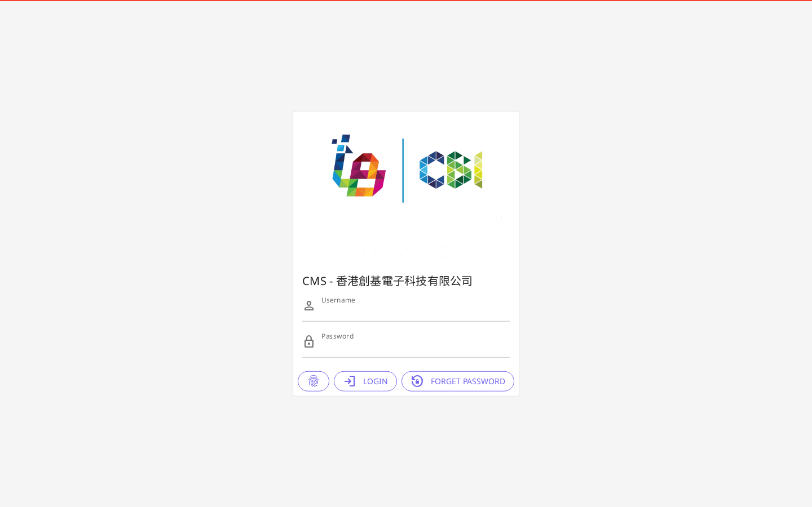

---

## 2. 產品管理 — 產品

### 功能說明
管理網站上展示嘅所有產品資料，包括新增產品、編輯現有產品內容及匯入產品列表。

### 頁面入口
**左側選單 → 產品**  
URL：https://chinabase.hlhk.net/cms/Product

### 主要功能

| 功能 | 說明 |
|------|------|
| 產品列表 | 顯示所有產品，可搜尋及篩選 |
| 新增產品 | 點擊「新增」按鈕新增產品 |
| 編輯產品 | 點擊產品列表中嘅「編輯」按鈕 |
| 查看產品 | 點擊「查看」按鈕預覽產品詳情 |
| 匯入產品列表 | 批量匯入產品（支援 Excel 格式） |

### 操作步驟（新增產品）

1. 喺左側選單點擊「**產品**」
2. 點擊頁面右上角「**新增**」按鈕
3. 填寫產品資料：
   - 產品名稱（繁體中文 / 簡體中文 / 英文）
   - 產品分類
   - 產品描述
   - 產品圖片（上傳）
4. 確認資料無誤後點擊「**儲存**」
5. 系統顯示成功訊息，產品出現於列表中

### 操作步驟（編輯產品）

1. 喺產品列表中找到目標產品
2. 點擊該產品旁邊嘅「**編輯**」按鈕
3. 修改所需資料
4. 點擊「**儲存**」確認更改

### 截圖
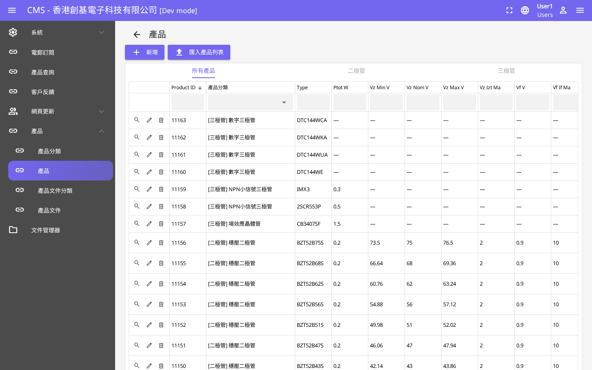

---

## 3. 產品管理 — 產品分類

### 功能說明
管理產品嘅分類結構，方便網站前台按分類展示產品。

### 頁面入口
**左側選單 → 產品分類**  
URL：https://chinabase.hlhk.net/cms/Category

### 主要功能
- 查看現有產品分類列表
- 新增產品分類
- 編輯分類名稱（支援多語言）
- 設定分類排序

### 操作步驟（新增分類）

1. 喺左側選單點擊「**產品分類**」
2. 點擊「**新增**」按鈕
3. 輸入分類名稱（繁中 / 簡中 / 英文）
4. 設定排序順序
5. 點擊「**儲存**」

### 截圖
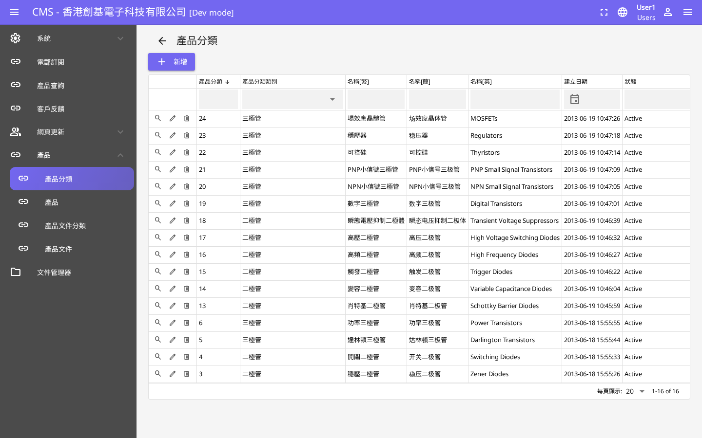

---

## 4. 產品管理 — 產品文件分類

### 功能說明
管理產品相關文件（如說明書、規格表）嘅分類標籤。

### 頁面入口
**左側選單 → 產品文件分類**  
URL：https://chinabase.hlhk.net/cms/DocCategory

### 主要功能
- 查看文件分類列表
- 新增 / 編輯文件分類名稱

### 操作步驟

1. 喺左側選單點擊「**產品文件分類**」
2. 查看現有文件分類列表
3. 如需新增：點擊「**新增**」→ 填寫名稱 → 儲存

### 截圖
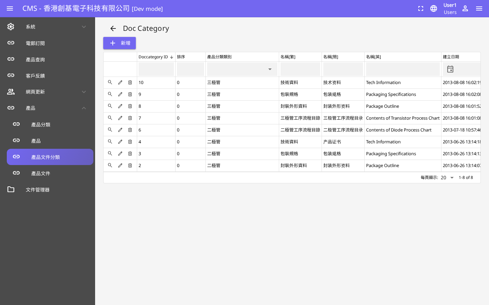

---

## 5. 產品管理 — 產品文件

### 功能說明
上傳及管理與產品相關嘅技術文件、規格書等資料。

### 頁面入口
**左側選單 → 產品文件**  
URL：https://chinabase.hlhk.net/cms/DocSubCategory

### 主要功能
- 上傳產品文件（PDF、DOC 等格式）
- 關聯至對應產品及分類
- 管理文件下載連結

### 操作步驟

1. 喺左側選單點擊「**產品文件**」
2. 點擊「**新增**」按鈕
3. 選擇對應嘅文件分類
4. 上傳文件檔案
5. 點擊「**儲存**」

### 截圖
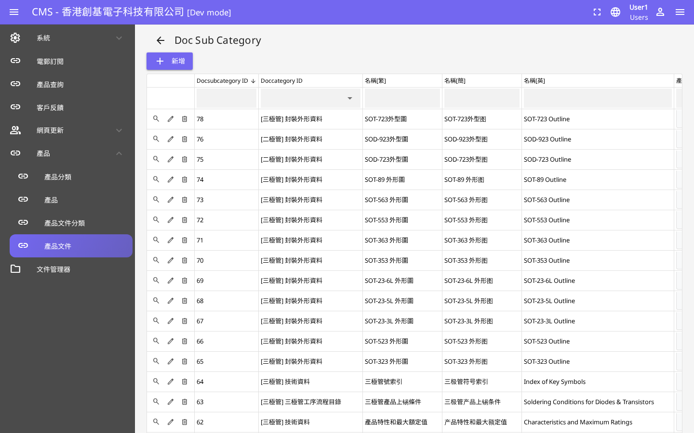

---

## 6. 內容管理 — 最新消息

### 功能說明
管理網站「最新消息」版塊嘅文章內容，可發佈公司新聞、產品資訊等。

### 頁面入口
**左側選單 → 最新消息**  
URL：https://chinabase.hlhk.net/cms/News

### 主要功能
- 查看所有已發佈及草稿消息
- 新增消息文章
- 編輯現有消息
- 設定發佈日期

### 操作步驟（發佈新消息）

1. 喺左側選單點擊「**最新消息**」
2. 點擊「**新增**」按鈕
3. 填寫消息資料：
   - 標題（繁中 / 簡中 / 英文）
   - 內容（支援富文本編輯）
   - 封面圖片
   - 發佈日期
4. 點擊「**儲存**」或「**發佈**」

### 截圖
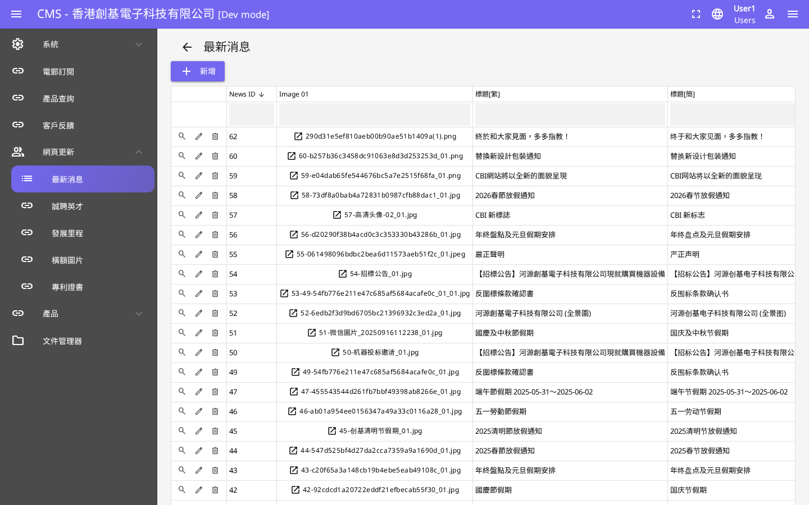

---

## 7. 內容管理 — 誠聘英才

### 功能說明
管理公司招聘資訊，發佈職位空缺供求職者查閱。

### 頁面入口
**左側選單 → 誠聘英才**  
URL：https://chinabase.hlhk.net/cms/Recruitment

### 主要功能
- 查看所有職位列表
- 新增招聘職位
- 編輯職位詳情
- 設定職位狀態（開放 / 關閉）

### 操作步驟（新增職位）

1. 喺左側選單點擊「**誠聘英才**」
2. 點擊「**新增**」按鈕
3. 填寫職位資料：
   - 職位名稱（多語言）
   - 職位描述及要求
   - 薪酬範圍
4. 點擊「**儲存**」

### 截圖
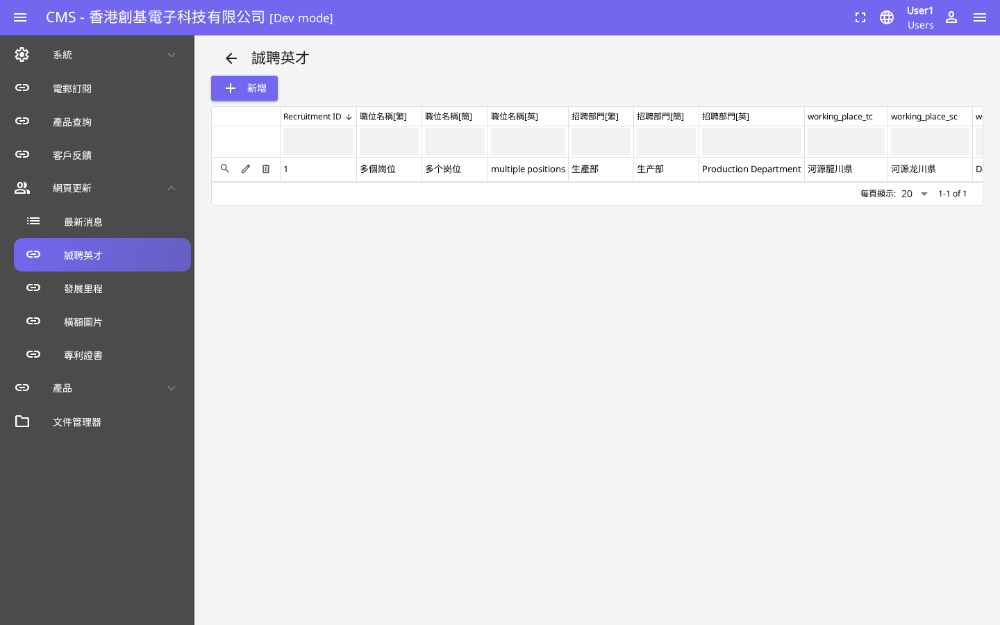

---

## 8. 內容管理 — 發展里程

### 功能說明
管理公司發展歷史及里程碑資料，展示於網站「關於我們」相關頁面。

### 頁面入口
**左側選單 → 發展里程**  
URL：https://chinabase.hlhk.net/cms/Developing

### 主要功能
- 查看公司里程碑時間線
- 新增里程碑事件
- 編輯現有事件（年份、描述）

### 操作步驟

1. 喺左側選單點擊「**發展里程**」
2. 查看現有里程碑列表
3. 點擊「**新增**」→ 填寫年份及事件描述 → 儲存

### 截圖
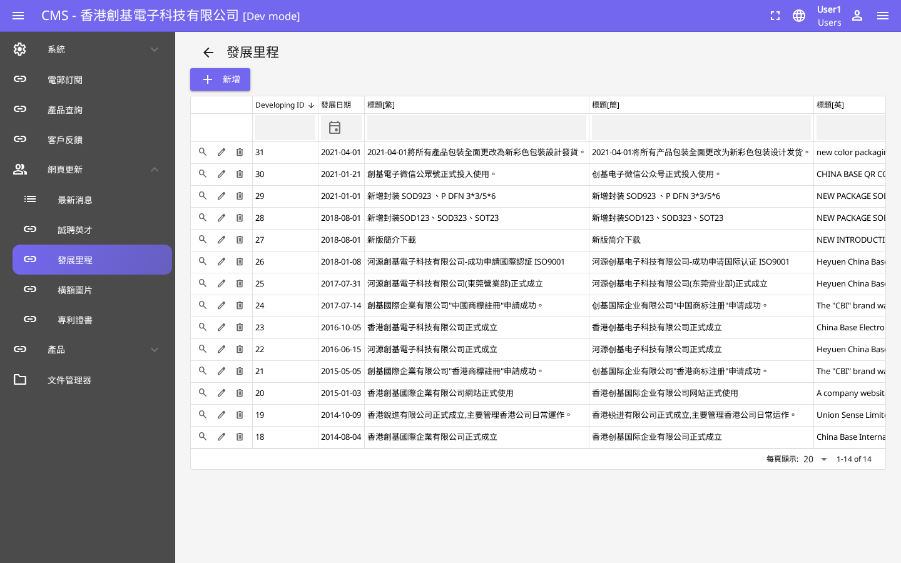

---

## 9. 內容管理 — 橫額圖片

### 功能說明
管理網站首頁及各頁面頂部嘅橫額（Banner）圖片輪播內容。

### 頁面入口
**左側選單 → 橫額圖片**  
URL：https://chinabase.hlhk.net/cms/BannerImage

### 主要功能
- 查看現有橫額圖片列表
- 上傳新橫額圖片
- 設定圖片順序及連結
- 啟用 / 停用特定橫額

### 操作步驟（更換橫額）

1. 喺左側選單點擊「**橫額圖片**」
2. 查看現有橫額列表
3. 如需新增：點擊「**新增**」→ 上傳圖片 → 設定連結及排序 → 儲存
4. 如需停用：點擊「**編輯**」→ 將狀態改為「停用」→ 儲存

### 截圖
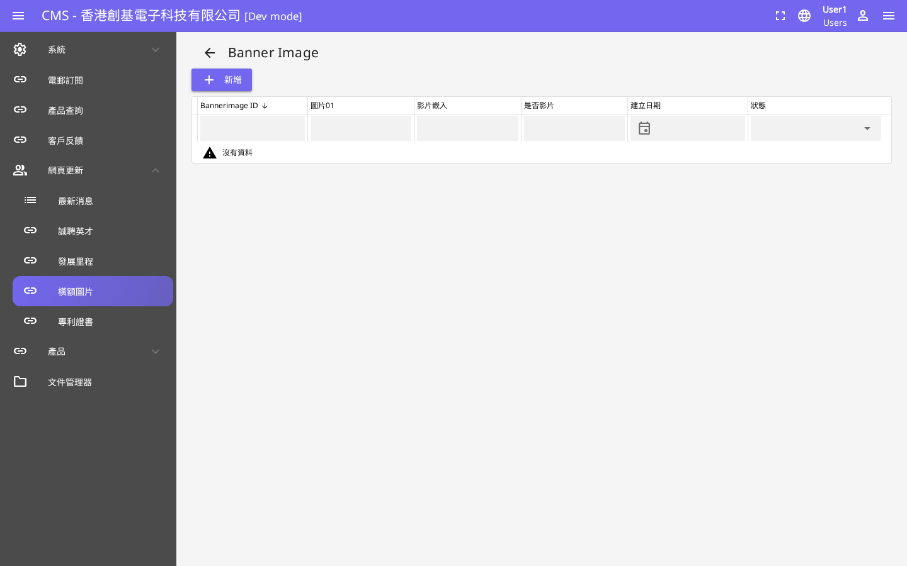

---

## 10. 內容管理 — 專利證書

### 功能說明
管理公司所獲得嘅專利及證書資料展示。

### 頁面入口
**左側選單 → 專利證書**  
URL：https://chinabase.hlhk.net/cms/Certificate

### 主要功能
- 查看所有證書列表
- 新增專利 / 證書
- 上傳證書圖片

### 操作步驟

1. 喺左側選單點擊「**專利證書**」
2. 點擊「**新增**」
3. 填寫證書名稱及上傳圖片
4. 點擊「**儲存**」

### 截圖
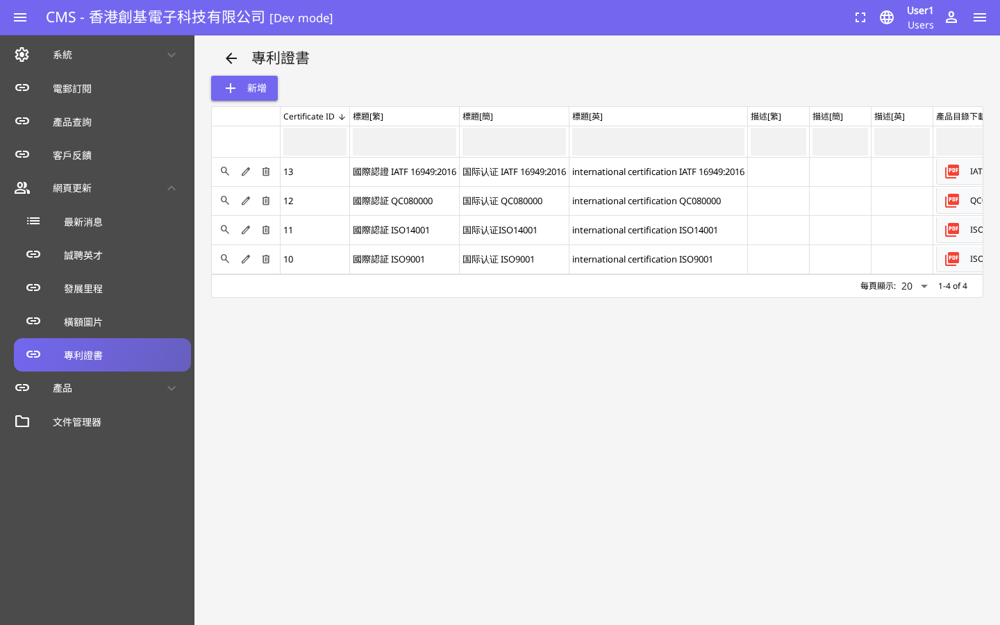

---

## 11. 查詢管理 — 電郵訂閱

### 功能說明
查看透過網站訂閱電郵通訊嘅用戶列表。

### 頁面入口
**左側選單 → 電郵訂閱**  
URL：https://chinabase.hlhk.net/cms/Subscriber

### 主要功能
- 查看所有訂閱者電郵地址
- 匯出訂閱者列表
- 管理訂閱狀態

### 操作步驟

1. 喺左側選單點擊「**電郵訂閱**」
2. 查看訂閱者列表
3. 如需匯出：點擊「**匯出**」按鈕下載 CSV 檔案

### 截圖
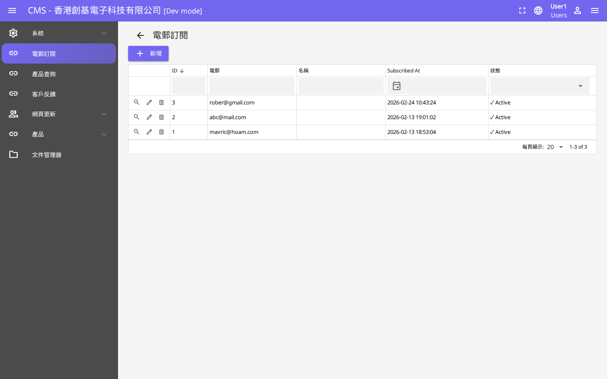

---

## 12. 查詢管理 — 產品查詢

### 功能說明
查看客戶透過網站產品頁面提交嘅查詢記錄。

### 頁面入口
**左側選單 → 產品查詢**  
URL：https://chinabase.hlhk.net/cms/ProductInquiry

### 主要功能
- 查看所有產品查詢記錄
- 查看查詢詳情（客戶資料 + 查詢內容）
- 標記查詢狀態（已處理 / 待處理）

### 操作步驟

1. 喺左側選單點擊「**產品查詢**」
2. 查看查詢列表（包含日期、客戶名稱、查詢產品）
3. 點擊任何一筆記錄查看詳細內容
4. 跟進後可更新查詢狀態

### 截圖

---

## 13. 查詢管理 — 客戶反饋

### 功能說明
查看客戶透過網站「聯絡我們」表格提交嘅反饋及查詢訊息。

### 頁面入口
**左側選單 → 客戶反饋**  
URL：https://chinabase.hlhk.net/cms/Enquiry

### 主要功能
- 查看所有客戶反饋記錄
- 查看反饋詳情
- 管理已讀 / 未讀狀態

### 操作步驟

1. 喺左側選單點擊「**客戶反饋**」
2. 查看反饋列表
3. 點擊記錄查看完整反饋內容
4. 跟進後標記為已處理

### 截圖
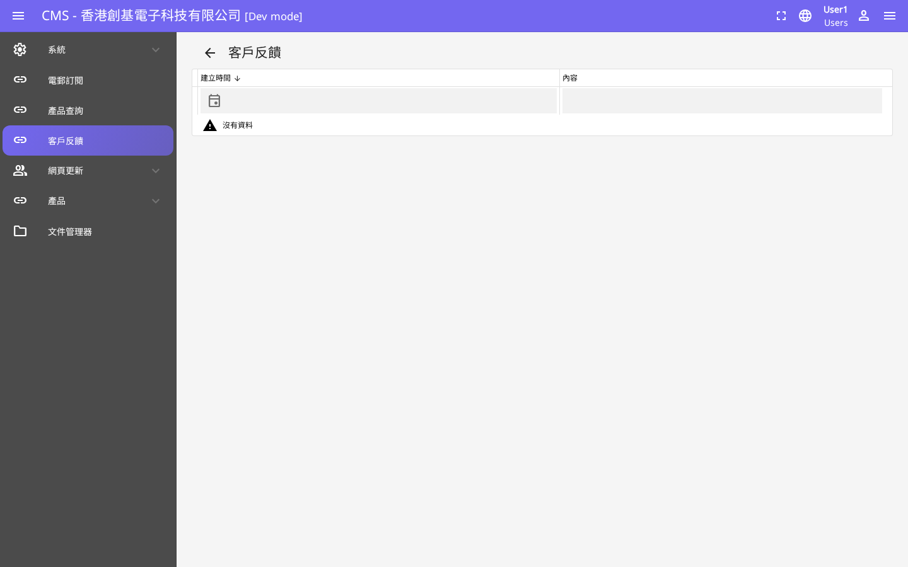

---

## 14. 系統工具 — 翻譯管理

### 功能說明
管理網站多語言內容翻譯，支援繁體中文、簡體中文及英文。

### 頁面入口
**左側選單 → 翻譯**  
URL：https://chinabase.hlhk.net/cms/Translate

### 主要功能
- 查看及編輯網站靜態文字嘅多語言翻譯
- 新增翻譯條目
- 批量匯入 / 匯出翻譯

### 操作步驟

1. 喺左側選單點擊「**翻譯**」
2. 搜尋需要更新嘅文字條目
3. 點擊「**編輯**」修改繁中 / 簡中 / 英文內容
4. 點擊「**儲存**」

### 截圖
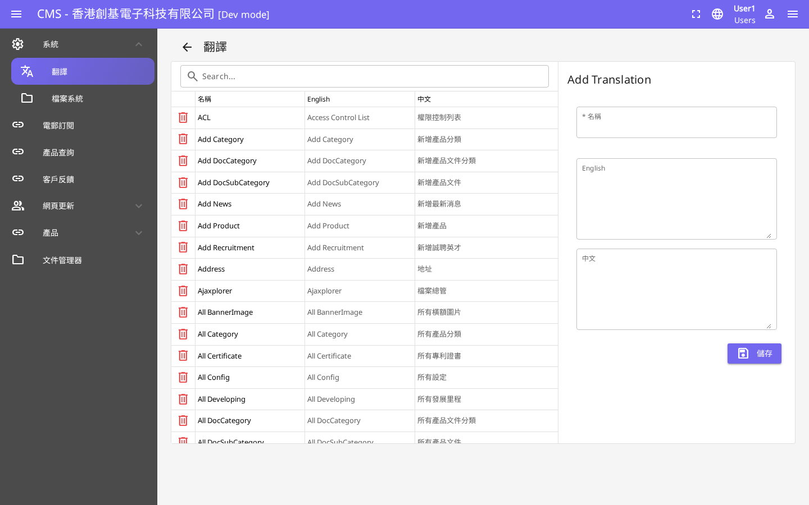

---

## 15. 系統工具 — 文件管理器

### 功能說明
管理 CMS 系統中所有已上傳嘅媒體檔案，包括圖片、PDF 及其他文件。

### 頁面入口
**左側選單 → 文件管理器**  
URL：https://chinabase.hlhk.net/cms/FileManager

### 主要功能
- 瀏覽已上傳嘅所有媒體文件
- 上傳新檔案
- 刪除不需要嘅舊檔案
- 複製檔案 URL 供其他模組使用

### 操作步驟（上傳檔案）

1. 喺左側選單點擊「**文件管理器**」
2. 瀏覽至目標資料夾
3. 點擊「**上傳**」按鈕
4. 選擇本地檔案（支援拖放）
5. 等待上傳完成
6. 複製檔案 URL 供使用

### 截圖
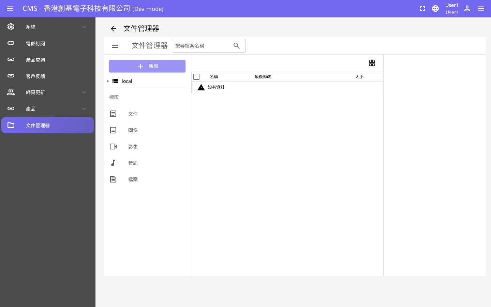

---

## 附錄：常見問題

### Q：登入後看不到某些模組？
A：可能係權限問題，請聯絡系統管理員確認帳號權限。

### Q：儲存後網站前台未更新？
A：部分內容可能需要幾分鐘緩存更新，請等候約 5 分鐘後重新整理前台頁面。

### Q：上傳圖片失敗？
A：請確認圖片格式（支援 JPG / PNG / GIF / WebP）及檔案大小（建議不超過 5MB）。

### Q：如何登出系統？
A：點擊右上角用戶名稱，選擇「登出」即可。

---

*文件由 A2 QA Orchestrator 自動生成 — 2026-03-10*
