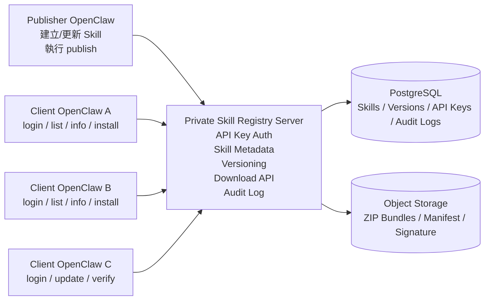

# OpenClaw 內部 Share Skill Registry Service 開發計劃書

**版本：** v0.3  
**日期：** 2026-03-16  
**對象：** Eric  
**用途：** 為公司內多部 OpenClaw 建立一個可登入、可列出 Skill、可下載/安裝、可發佈更新的私有 Skill 分享與 Registry Service

---

## 0. 最新狀態（2026-03-16）

### 已完成
- 已建立第一版 **MVP scaffold**
- 已建立 **獨立 GitHub private repo**：`Area2-HK-Limited/openclaw-skill-marketplace`
- 已交付：
  - monorepo 基礎結構
  - Fastify registry API scaffold
  - CLI scaffold（login / list / info / publish / install / update）
  - PostgreSQL schema
  - MinIO storage layer
  - docker-compose.yml
  - `.env.example`
  - `README.md`
  - `docs/API_SPEC_V1.md`
  - `docs/DB_SCHEMA_V1.md`
  - `docs/MVP_TASKS.md`

### 已確認部署前提
- **私有 / 內網用途**，唔做公開 domain
- **其他 OpenClaw Docker 與 registry server 同一部伺服器部署**
- 採用 **獨立 compose project**，避免同現有 OpenClaw compose 衝突
- 預設 API bind `127.0.0.1`
- 目前方向以 **同機多容器共用 registry** 為優先

### 目前未完成 / 下一步
- 喺目標 server 做一次真正 **docker deploy + smoke test**
- 驗證 `publish -> list -> info -> install` 全流程
- 視 smoke test 結果決定：
  - 保留 MinIO presigned URL download
  - 或改做 API proxy download

---

## 1. 項目目標

建立一個**公司內部專用、私有、可多機共用**的 Skill Share / Registry Service，讓你在其中一部 OpenClaw 建好某個 Skill 後，可以：

1. 發佈到公司內部私有 registry
2. 用 API Key 讓另一部機器登入
3. 以 CLI 方式查看可用 Skill List
4. 查看單個 Skill 詳情與版本
5. 下載/安裝到另一部 OpenClaw 的 `skills/` 目錄
6. 日後可 update / rollback / audit 誰發佈過甚麼版本
7. 全程唔公開對外，只供你公司內部 OpenClaw 使用

---

## 1.1 名詞解釋

### MVP = Minimum Viable Product（最小可行產品）

MVP 唔係「半成品」，而係：

> **用最少但足夠嘅核心功能，先將整個流程跑通、可實際使用、可驗證方向正確嘅第一版。**

對呢個項目嚟講，MVP 應至少做到：
- 可用 API Key 登入
- 可列出內部可用 Skills
- 可查看 Skill 詳情與版本
- 可 publish 一個 Skill
- 可 download / install 到其他 OpenClaw 機
- 可做基本 checksum 驗證

### 正式版

正式版係指喺 MVP 跑通之後，再補上：
- 更完整權限控制
- audit log 完整報表
- signature / verify
- Web UI
- 進階搜尋 / tag / rollback / 管理功能

### 點解要先做 MVP

因為可以：
1. 先驗證成個「Share Skill → Registry → Client Install」流程係 work
2. 用最短時間交付第一個可用版本
3. 避免一開始做太重，浪費時間喺非必要功能
4. 方便日後按實際使用情況再擴充正式版

---

## 2. 可行性結論

## 結論：**可行，而且唔需要先改 OpenClaw Core。**

原因：

1. **OpenClaw 本身已支援本地/工作區 Skill 載入。**
   - Skills 會由以下位置載入：
     - `<workspace>/skills`（最高優先）
     - `~/.openclaw/skills`
     - bundled skills
   - 即係話，只要 CLI 幫你將 Skill bundle 下載並解壓到正確位置，OpenClaw 下一個 session 就會識得用。

2. **ClawHub 已證明「Skill Registry + CLI 安裝」這個模式係成立。**
   - 公開文件顯示 ClawHub 已有：publish / install / update / list / login token / registry override / versioning / lockfile 等概念。
   - 所以你要做私有版，唔係由零開始發明，而係將現有公開 registry 模式私有化、輕量化。

3. **你要嘅其實係「Private Registry + CLI Installer」，唔一定要做完整社群 Marketplace。**
   - 你現階段唔需要 public search、comments、stars、moderation panel。
   - 最有性價比做法係：**先做一個輕量 private registry service + 一個專用 CLI。**

### 2.1 定位修正（按 Eric 原意）

呢份方案嘅真正定位應該係：

> **公司內部 Share Skill 平台 / Private Skill Registry**

而唔係對外公開嘅 marketplace。

即係話：
- **Publisher**：你喺其中一部 OpenClaw 建 Skill、發佈 Skill
- **Registry Server**：中間一層私有服務，負責保存 bundle、metadata、版本、權限
- **Clients**：其他 OpenClaw 機器用 API Key 登入，列出、下載、安裝 Skill

**重要：** 呢個 Registry Server 係**邏輯上必須存在**，但 **MVP 可以實際部署喺同一部 Publisher 機器上**，唔需要一開始就獨立開另一台 server。

---

## 3. 建議路線（我推薦嘅最務實方案）

## **推薦：唔好一開始 fork / self-host 全套 ClawHub。**

### 我建議你行呢條路：

**Phase 1 做一個輕量 Private Skill Registry Service**，功能只包括：
- API Key 驗證
- Skill metadata 管理
- 版本管理
- zip bundle 上傳/下載
- checksum 驗證
- CLI login / list / info / install / publish / update

### 唔建議一開始 fork 全套 ClawHub 嘅原因

1. **ClawHub 偏向公開社群產品。**
   - 有 public browse、stars、comments、report、moderation、usage signals
   - 呢啲對你內部自用未必即時需要

2. **維護成本高。**
   - 一 fork，就要跟 upstream schema / API / UI / auth / versioning 變化
   - 自用場景唔值得一開始負擔呢個 maintenance burden

3. **你真正需要嘅只有 20% 功能。**
   - publish / list / info / install / update / audit
   - 輕量服務更快落地

### 甚麼時候先考慮 fork / self-host 類似 ClawHub？

只有當你將來想要以下功能時先值得：
- Web UI marketplace
- Embedding search / semantic search
- comments / stars / moderation
- 多團隊 / 多租戶 / 公私混合 registry
- 完整公開分享能力

**所以現階段最務實建議：**
> **做一個「ClawHub 概念相容，但實作更輕」的私人 Skill Registry。**

---

## 4. 現有 OpenClaw / ClawHub 可直接重用的概念

### 可以直接沿用

1. **Skill package 概念**
   - 一個 Skill 其實就係一個目錄
   - 核心係 `SKILL.md`
   - 另外可附 `scripts/`, `assets/`, `references/` 等檔案

2. **Skill 安裝目標位置**
   - 下載後裝入 `<workspace>/skills/<skill-name>/`
   - 或共享到 `~/.openclaw/skills/<skill-name>/`

3. **版本化思路**
   - 每次 publish 建立新版本
   - semver（例如 `1.0.0`, `1.0.1`, `1.1.0`）

4. **CLI 使用體驗**
   - `login`
   - `list`
   - `info`
   - `install`
   - `publish`
   - `update`

5. **lockfile 思路**
   - 記錄本機已安裝咗邊個 skill、版本、來源 registry、checksum

### 值得參考 ClawHub 的地方（建議借鏡，但唔好照抄整套）

1. **Registry + CLI 分工模式**
   - Server 管版本與下載
   - CLI 管 publish / install / update
   - 呢個分工好清晰，值得直接沿用

2. **版本化 bundle 設計**
   - 每次 publish 一個新版本
   - 版本可追溯、可 rollback
   - 非常適合內部 Skill 管理

3. **登入與 Registry Override 概念**
   - 公開版 ClawHub 用 token + registry URL
   - 私有版可以改成 API Key + 私有 registry URL
   - 呢個使用體驗值得保留

4. **lockfile / 本機安裝狀態追蹤**
   - 安裝過咩 skill、咩版本、來自邊個 registry，要有記錄
   - 對日後 update / verify / audit 很有用

5. **非互動式 CLI 設計**
   - `--json`
   - `--force`
   - `--version`
   - `--no-input`
   - 呢啲對 AI Agent 自動化非常重要，建議由 Day 1 支援

6. **內容 hash 比對思路**
   - 用內容 hash 去判斷本機是否曾修改、是否需要覆蓋
   - 對內部團隊共用 Skill 好實用

### 唔建議直接照搬 ClawHub 的部分

1. public browse / comments / stars
2. moderation / report 機制
3. 社群 ranking / telemetry
4. 公開搜索與發現頁
5. 面向陌生人上架技能的治理邏輯

**總結：**
> 你應該借 ClawHub 嘅 **結構設計與交互模式**，但產品定位應明確改成 **公司內部私有 Skill Registry**，而唔係公開 marketplace。

### 需要自己補上的部分

1. **Private visibility / allowlist**
2. **API Key auth + scope**
3. **審計記錄（audit log）**
4. **簽章 / checksum 驗證機制**
5. **你的自定 workflow（例如 AI Agent 可讀的 `-help` / `-list` 體驗）**
6. **是否支援 group / machine-based access control**

---

## 5. 整體架構建議

## 5.1 系統組件

### A. Registry API Server
負責：
- API Key 驗證
- Skill metadata CRUD
- 版本 metadata
- bundle 上傳/下載
- 安裝事件記錄
- audit log

### B. Object Storage
建議：
- **MVP：MinIO / Cloudflare R2 / S3 任擇其一**
- 儲存 skill bundle zip、manifest、signature

### C. Database
建議：
- **PostgreSQL**
- 儲存 skill、version、API key、audit log、下載記錄

### D. CLI Client
建議名稱：
- `oc-market`
- 或 `openclaw-market`
- 或 `skillhub`

CLI 角色：
- login 儲存 API key
- list/info 顯示 registry 內容
- install 下載 skill 並解壓到本機 `skills/`
- publish 打包本地 skill 並上傳
- update 檢查新版本

### E. OpenClaw Integration Layer
MVP 不需要改 OpenClaw core，只需要：
- CLI 將 skill 安裝到 `skills/`
- 提示 user / agent「開新 session 即生效」
- 如日後需要，再加：
  - OpenClaw plugin
  - agent 可直接呼叫 registry API / CLI

## 5.1.1 三層架構圖（Publisher / Registry Server / Clients）



### 架構解讀

- **Publisher 層**：你平時寫 Skill、改 Skill、發佈新版本嘅地方
- **Registry Server 層**：中間核心，負責權限控制、版本管理、下載入口、審計記錄
- **Client 層**：其他公司內 OpenClaw 機器，用 API Key 連入 Registry，按需要安裝或更新 Skill

### MVP 部署說明

MVP 可以係：
- **Publisher 同 Registry Server 跑喺同一部機**
- 其他 OpenClaw 透過內網 / VPN / Tunnel 連過嚟

即係話，**邏輯上係三層，物理上可以先兩層合一**，咁樣最慳時間、最易起步。

---

## 5.2 建議技術棧

### MVP 建議
- **Backend:** Node.js + Fastify / Hono
- **DB:** PostgreSQL
- **Storage:** MinIO（自架最簡單）或 Cloudflare R2（省 server disk）
- **CLI:** Node.js（Commander / Yargs）
- **Archive:** zip
- **Checksum:** SHA-256
- **Signature:** Ed25519（Phase 2）

### 正式版建議
- Backend 保持 Node.js 即可
- 可加 Web UI（Nuxt）作管理頁
- 可加 search / tags / audit dashboard

---

## 6. 用戶流程設計

## 6.1 發佈流程（Publisher）

1. 在本機建立/更新 skill folder
2. 執行：
   - `oc-market publish ./skills/my-skill --version 1.0.0`
3. CLI：
   - 驗證 `SKILL.md` 是否存在
   - 解析 metadata
   - 打包成 zip
   - 產生 `manifest.json`
   - 計算 SHA-256 checksum
   - 上傳 bundle + metadata
4. Registry：
   - 寫入 skill / version metadata
   - 儲存 zip 到 object storage
   - 記錄 publish audit log

## 6.2 登入流程（Consumer Machine）

1. 在另一部機器執行：
   - `oc-market login --api-key xxxx`
2. CLI 將 token 存到本機 config：
   - 建議 `~/.config/oc-market/config.json`
3. 後續所有 API 呼叫都用 Bearer token

## 6.3 List / Info 流程

- `oc-market list`
- `oc-market info my-skill`
- `oc-market help`

CLI 會：
- 呼叫 registry API
- 顯示 skill 名稱、版本、summary、tags、更新時間、是否可安裝

## 6.4 安裝流程

1. 執行：
   - `oc-market install my-skill`
2. CLI：
   - 查最新版本
   - 下載 zip + manifest
   - 驗證 checksum
   - 解壓到：
     - 預設 `<workspace>/skills/my-skill/`
   - 更新 lockfile
3. 完成後提示：
   - 「請開新 session，或等 skills watcher refresh」

## 6.5 更新流程

- `oc-market update my-skill`
- `oc-market update --all`

比對：
- lockfile 版本 vs registry 最新版本
- 如有更新，下載並覆蓋

---

## 7. CLI 指令設計

## 7.1 指令原則

你特別提到 AI Agent 要方便用，所以 CLI 必須：
- 命令名短
- `--help` 清楚
- `list` 可簡潔輸出
- 支援 `--json` 給 agent parse
- 支援 exit code 清晰（0 成功 / 非0 失敗）

## 7.2 建議指令集

```bash
oc-market --help
oc-market login --api-key <KEY>
oc-market logout
oc-market whoami

oc-market list
oc-market list --tag qa
oc-market list --json

oc-market info <slug>
oc-market info <slug> --version 1.2.0

oc-market install <slug>
oc-market install <slug> --version 1.2.0
oc-market install <slug> --target workspace
oc-market install <slug> --target managed

oc-market download <slug> --version 1.2.0 --output /tmp/skill.zip

oc-market publish <path>
oc-market publish <path> --slug my-skill --version 1.0.0 --changelog "Initial release"

oc-market update <slug>
oc-market update --all

oc-market remove <slug>
oc-market verify <slug>
```

## 7.3 建議輸出格式

### `oc-market list`
```text
SLUG              VERSION   TAGS            UPDATED
qa-testing        1.4.2     qa,tester       2026-03-15
sem-report        2.1.0     report,ads      2026-03-12
invoice-ninja     1.8.0     billing,api     2026-03-10
```

### `oc-market list --json`
```json
[
  {
    "slug": "qa-testing",
    "latestVersion": "1.4.2",
    "summary": "網站 QA 測試 skill",
    "tags": ["qa", "tester"],
    "updatedAt": "2026-03-15T14:00:00Z"
  }
]
```

### `oc-market info qa-testing`
```text
Name: qa-testing
Latest: 1.4.2
Summary: 網站 QA 測試 skill
Tags: qa, tester
Versions: 1.4.2, 1.4.1, 1.4.0
Install Target: workspace|managed
Checksum: sha256:xxxx
```

---

## 8. Registry API 設計

## 8.1 Auth

所有 API 使用：
- `Authorization: Bearer <API_KEY>`
- 伺服器端只儲存 key hash，不存 plaintext

## 8.2 Endpoint 建議

| Method | Endpoint | 用途 |
|---|---|---|
| GET | `/v1/health` | 健康檢查 |
| GET | `/v1/me` | 取得目前 key 身分 / scope |
| GET | `/v1/skills` | 列出可見 skills |
| GET | `/v1/skills/:slug` | skill 詳情 |
| GET | `/v1/skills/:slug/versions` | 版本列表 |
| GET | `/v1/skills/:slug/versions/:version` | 單版本 metadata |
| GET | `/v1/skills/:slug/download?version=x.y.z` | 下載 bundle |
| POST | `/v1/skills/publish` | 發佈新 skill 或新版本 |
| POST | `/v1/skills/:slug/verify` | 驗證 bundle/checksum（可選） |
| GET | `/v1/audit/publish` | 查 publish audit（admin） |
| POST | `/v1/api-keys` | 建立 API key（admin） |
| GET | `/v1/api-keys` | 列出 API keys（admin） |
| POST | `/v1/api-keys/:id/revoke` | 吊銷 key（admin） |

## 8.3 Publish API 請求內容

### multipart/form-data
- `bundle` = zip file
- `manifest` = JSON 字串
- `changelog` = 文字
- `visibility` = private / restricted

---

## 9. 資料表設計

## 9.1 `users`
| 欄位 | 類型 | 說明 |
|---|---|---|
| id | uuid | 主鍵 |
| name | text | 顯示名 |
| email | text | 可選 |
| role | text | owner/admin/member |
| created_at | timestamptz | 建立時間 |

## 9.2 `api_keys`
| 欄位 | 類型 | 說明 |
|---|---|---|
| id | uuid | 主鍵 |
| user_id | uuid | 持有人 |
| key_prefix | text | 例如 `ocm_xxxx` 前綴 |
| key_hash | text | SHA-256 hash |
| scopes | jsonb | read/publish/admin |
| label | text | 機器名稱/用途 |
| expires_at | timestamptz | 到期日（可空） |
| last_used_at | timestamptz | 最後使用 |
| revoked_at | timestamptz | 吊銷時間 |
| created_at | timestamptz | 建立時間 |

## 9.3 `skills`
| 欄位 | 類型 | 說明 |
|---|---|---|
| id | uuid | 主鍵 |
| slug | text unique | skill 唯一識別 |
| name | text | 顯示名稱 |
| summary | text | 簡介 |
| owner_user_id | uuid | 擁有人 |
| visibility | text | private/restricted |
| tags | jsonb | tag 陣列 |
| latest_version | text | 最新版本 |
| created_at | timestamptz | 建立時間 |
| updated_at | timestamptz | 更新時間 |

## 9.4 `skill_versions`
| 欄位 | 類型 | 說明 |
|---|---|---|
| id | uuid | 主鍵 |
| skill_id | uuid | 關聯 skill |
| version | text | semver |
| manifest_json | jsonb | manifest |
| changelog | text | 更新說明 |
| bundle_path | text | object storage 路徑 |
| bundle_sha256 | text | 校驗值 |
| bundle_size | bigint | 檔案大小 |
| signature | text | Phase 2 |
| published_by | uuid | 發佈者 |
| published_at | timestamptz | 發佈時間 |

## 9.5 `skill_permissions`
| 欄位 | 類型 | 說明 |
|---|---|---|
| id | uuid | 主鍵 |
| skill_id | uuid | skill |
| principal_type | text | user/group/machine |
| principal_id | text | 允許對象 |
| can_read | boolean | 可讀 |
| can_publish | boolean | 可發佈 |

## 9.6 `install_events`
| 欄位 | 類型 | 說明 |
|---|---|---|
| id | uuid | 主鍵 |
| skill_id | uuid | skill |
| version | text | 版本 |
| installed_by | uuid | user |
| machine_label | text | 哪部機 |
| installed_at | timestamptz | 時間 |

## 9.7 `audit_logs`
| 欄位 | 類型 | 說明 |
|---|---|---|
| id | uuid | 主鍵 |
| actor_id | uuid | 操作人 |
| action | text | publish/install/revoke/delete |
| target_type | text | skill/api_key/version |
| target_id | text | 目標 |
| metadata | jsonb | 詳細資料 |
| created_at | timestamptz | 時間 |

---

## 10. Skill Package 格式與 Metadata Schema

## 10.1 Bundle 格式

建議每次 publish 都生成：
- `my-skill-1.0.0.zip`

zip 內容：
```text
my-skill/
  SKILL.md
  scripts/
  assets/
  references/
  manifest.json
```

## 10.2 `manifest.json` 建議欄位

```json
{
  "slug": "qa-testing",
  "name": "qa-testing",
  "version": "1.4.2",
  "summary": "網站 QA 測試 skill",
  "tags": ["qa", "tester"],
  "entry": "SKILL.md",
  "files": [
    { "path": "SKILL.md", "sha256": "..." },
    { "path": "scripts/run.sh", "sha256": "..." }
  ],
  "bundleSha256": "...",
  "requires": {
    "bins": ["python3"],
    "env": ["API_KEY"]
  },
  "homepage": "https://example.com",
  "publishedAt": "2026-03-15T14:00:00Z"
}
```

## 10.3 版本策略

建議用 semver：
- `major`：破壞性變更
- `minor`：新增功能
- `patch`：修正/內容更新

### 例子
- `1.0.0` 初版
- `1.0.1` 修 typo / prompt 微調
- `1.1.0` 加 scripts / asset
- `2.0.0` 改 SKILL interface 或 command contract

---

## 11. 安全設計

## 11.1 API Key 設計

### Key 格式建議
- 顯示：`ocm_live_xxxxxxxxxxxxx`
- DB 只儲存：
  - `key_prefix`
  - `key_hash`

### Scope 建議
- `skills:read`
- `skills:publish`
- `skills:admin`

### 最佳實踐
1. 每部機器一條 key，唔好全公司共用一條 master key
2. key 要可 revoke
3. key 要有 label（例如 `mac-mini-office`, `vm-1-b03`）
4. server 端只存 hash
5. 使用 HTTPS
6. 重要操作記 audit log

## 11.2 Bundle 完整性

MVP 必做：
- SHA-256 checksum 驗證
- CLI 安裝前先 verify

Phase 2 建議：
- Ed25519 簽章
- registry response 帶 signature
- CLI verify signature 後先解壓

## 11.3 Visibility / 權限

建議預設：
- **private by default**

可選模式：
- `private`：只有 owner / admin 可見
- `restricted`：allowlist 用戶或機器可見
- `shared-team`：同一工作群組可見（Phase 2）

## 11.4 審計要求

以下操作必須記錄：
- login 成功/失敗（可簡化）
- publish
- install
- update
- delete / revoke
- 權限變更

---

## 12. 與 OpenClaw 的整合方式

## MVP 整合：**零 core 改動**

### 安裝位置選項
1. `--target workspace`
   - 安裝到 `<workspace>/skills`
   - 只影響該 workspace / agent

2. `--target managed`
   - 安裝到 `~/.openclaw/skills`
   - 同機多 agent 可共用

### 生效方式
- 新 session 自動讀到
- 或等待 skills watcher refresh

### CLI 對 agent 友善要求
- `oc-market list --json`
- `oc-market info <slug> --json`
- `oc-market install <slug> --json`

方便 AI Agent 用 `exec` 後 parse 結果。

---

## 13. MVP / 正式版部署建議

## 13.1 MVP（最快落地）

### 架構
- 1 個 Node.js API Server
- 1 個 PostgreSQL
- 1 個 MinIO / R2 bucket
- 1 個 CLI

### 部署位置
你現有環境可選：
1. **Cloudflare Tunnel + 私有 API Server**
2. **一部 VPS / LightHouse**
3. **內網 VM + 反向代理**

### 我推薦
**MVP：Node.js API + PostgreSQL + MinIO，部署喺你最穩定、長開嘅主機。**

如果想最簡：
- DB：Postgres
- Bundle：直接放 local disk
- 後面再搬去 R2/MinIO

## 13.2 正式版

加：
- Web Admin UI
- Search / tag filter
- API key 管理頁
- Role-based access control
- Signature verify
- 安裝統計
- webhook / notify

---

## 14. 分階段開發時程

## Phase 0 — 規格確認（0.5 - 1 日）

目標：定清楚最小可行需求
- 定 CLI 名稱
- 定 install target
- 定 visibility 模式
- 定 DB schema v1
- 定 bundle/manifest format

**交付：** API spec + CLI spec + DB schema

## Phase 1 — Registry 核心（2 - 3 日）

- 建 PostgreSQL schema
- 建 `/v1/skills` / `/v1/skills/:slug`
- 建 `/v1/skills/publish`
- 建 object storage 上傳/下載
- 建 API key 驗證 middleware

**交付：** 可 publish / list / download 的後端

## Phase 2 — CLI（2 日）

- `login`
- `whoami`
- `list`
- `info`
- `install`
- `publish`
- `update`

**交付：** 兩部機之間可真正發佈 + 安裝 skill

## Phase 3 — 安全與驗證（1 - 2 日）

- checksum verify
- lockfile
- audit log
- revoke key
- install event tracking

**交付：** 可放心日常使用的內部版

## Phase 4 — 增強版（2 - 4 日）

- Web UI
- allowlist / team sharing
- signature
- 搜索 / tag
- rollback

**交付：** 正式內部產品版

### 總工期估算
- **MVP：5 - 7 個工作日**
- **正式版：8 - 12 個工作日**

如果同時要做 UI，同一個人開發可能拉長到 2 週以上。

---

## 15. 風險與 Fallback

## 15.1 風險

### 風險 A：Skill 結構唔一致
不同 skill 可能有：
- 缺 `SKILL.md`
- 引用外部路徑
- scripts 依賴本機 binary

**解法：** publish 前做 validator

### 風險 B：下載後未即時生效
OpenClaw session snapshot 可能要新 session 先反映

**解法：** CLI 完成後明確提示「請開新 session」

### 風險 C：私鑰 / API Key 外洩

**解法：**
- 只存 hash
- 每機獨立 key
- 可 revoke
- scope 最小化

### 風險 D：安裝覆蓋本機修改

**解法：**
- lockfile
- install / update 前比對 local hash
- 發現本機改動要提示 `--force`

### 風險 E：你之後想兼容 ClawHub 正式協議

**解法：**
- API 命名、manifest、versioning 盡量向 ClawHub 概念靠攏
- 但唔好硬綁死 implementation

## 15.2 Fallback 方案

如果你想**更快開始**，甚至可以先做：

### 超輕量臨時版（Fallback MVP）
- 用 Git repo 當 registry
- 每個 skill 一個 folder / 或 zip release
- CLI 其實只係：
  - git clone / pull
  - copy 到 `skills/`
  - list 讀 manifest index.json

### 優點
- 1-2 日可做完

### 缺點
- API key 權限控制較弱
- install / publish workflow 唔夠乾淨
- audit / download / checksum / access control 唔夠完整

**所以我唔建議呢個做正式方案，但可以作 Phase 0 原型。**

---

## 16. 驗收標準

以下全部做到，先算 MVP 完成：

1. 可以用 API Key 成功登入 CLI
2. 其中一部機可 publish 一個本地 skill
3. 另一部機可以 `list` 見到該 skill
4. 可以 `info` 睇版本與摘要
5. 可以 `install` 到本機 `skills/` 目錄
6. 下載後 CLI 會驗證 checksum
7. OpenClaw 新 session 可讀到該 skill
8. 可以 `update` 到新版本
9. 可以 revoke 某條 API key，revoke 後該 key 失效
10. publish / install / revoke 有 audit log

---

## 17. 尚待拍板事項（更新後）

第一版 scaffold 已完成，而家尚待 Eric 拍板嘅主要係：

1. **CLI 名稱**
   - `oc-market` / `ocm` / 其他

2. **安裝預設位置**
   - 預設裝去 `<workspace>/skills`
   - 定 `~/.openclaw/skills`

3. **Storage 方案（MVP 之後）**
   - 先 keep MinIO
   - 定之後搬去 Cloudflare R2

4. **容器接駁方式**
   - 先用 bridge IP（例如 `172.17.0.1`）
   - 定改用 shared Docker network

5. **Bundle 下載模式**
   - 保留 MinIO presigned URL
   - 定改做 API proxy download

6. **是否需要 Web UI**
   - 我建議 MVP 唔做，先做 CLI + smoke test

---

## 18. 最終建議（一句版）

> **對你而家呢個場景，最啱係做一個「輕量私有 Skill Registry + API Key CLI Installer」，直接利用 OpenClaw 現成的本地 skills 載入機制；唔好一開始 fork 全套 ClawHub。**

---

## 19. 下一步建議

由於第一版 scaffold 已完成，下一步建議改為：

1. 喺目標 server 用 `docker compose` 真正部署一次
2. 跑 migration + seed，拎第一條 admin API key
3. 由同機另一個 OpenClaw container 做 `login -> list -> publish -> install` smoke test
4. 確認 bundle download 路徑（presigned URL / API proxy）邊條更穩
5. smoke test 過咗先再做下一輪功能開發

---

## 20. 補充：為何這條路最穩

因為它：
- **最少依賴 OpenClaw core 改動**
- **最貼近你現有工作模式**
- **最快做到多機共用**
- **之後要升級成完整 marketplace 亦唔會推倒重來**

先做 private registry，把「發佈 → 查詢 → 安裝 → 更新」跑通，已經夠用；之後先慢慢加 UI、搜索、簽章、群組分享，先係最穩陣。
