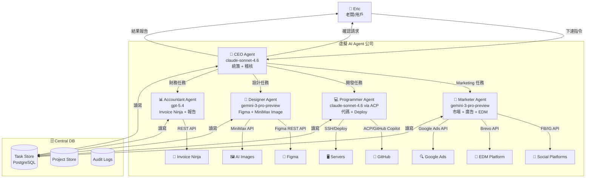

# 虛擬 AI Agent 公司 — 完整開發計劃書

*版本: v0.4 | 日期: 2026-03-14 | 作者: A2*

---

## 一、項目概覽

### 背景
Eric 希望建立一間「虛擬 AI Agent 公司」，參考 YouTube 頻道「追日Gucci」展示嘅 OpenClaw 多 Agent 架構（CEO 拉拉統籌 6 個 Agent），並加入 Area2 及 Hostlink 嘅真實業務需求，打造一支由 AI 組成嘅全職能數碼團隊。

### 目標
- 用 AI Agent 取代或輔助重複性工作（Marketing、編程、設計、財務）
- 所有 Agent 由 CEO Agent 統籌，老闆（Eric）只需要下達高層指令
- 建立可擴展嘅 Multi-Agent 架構，未來可加入更多 Agent
- 顯著降低人工成本，提升工作效率

### 核心設計原則
1. **Orchestration-first** — CEO Agent 係唯一入口，唔允許 Worker Agent 直接接收 Eric 命令
2. **Human-in-the-loop** — 重要決策、對外發布必須經 Eric 確認
3. **Async-first** — 所有耗時任務非同步執行，結果 push 通知
4. **Central DB** — 統一 Task Store，所有 Agent 共用
5. **Observability** — 所有 Agent 行動有 log，可審計

---

## 二、系統架構圖（Mermaid）



---

## 三、Agent 職位詳細設計

### CEO Agent

**角色定位：** 公司大腦，唯一同 Eric 溝通嘅入口

**主要職責：**
- 接收 Eric 嘅 Order，分析需求，拆解成子任務
- 評估任務優先級，分派給合適嘅 Worker Agent
- 監察所有 Agent 進度，稽核輸出質素
- 需要 Eric 決策嘅情況，主動提問並等待確認
- 整合所有 Agent 結果，向 Eric 匯報

**決策流程：**
```
Eric 下達指令
    ↓
CEO 分析任務類型 + 複雜度
    ↓
判斷需否 Eric 確認（高風險/預算/對外發布）
    ├── 需要 → 向 Eric 提問，等待批准
    └── 不需要 → 直接分派任務
    ↓
分派任務到 Central DB（帶優先級 + Deadline）
    ↓
Worker Agent 執行 → 定時 poll DB
    ↓
CEO 收到結果 → 稽核質素
    ├── 合格 → 彙整回報 Eric
    └── 不合格 → 退回 Worker，要求修改
```

**觸發需 Eric 確認的情況：**
- 預算相關決策（廣告投放金額 > HKD 500）
- 對外正式發布（Social Post、EDM 發送）
- 代碼部署到 Production
- 新客戶開發票或合約
- 涉及敏感數據操作

---

#### 🗣️ Brainstorming 辯論機制

**觸發條件（任一）：**
- CEO 收到 Eric「開會」/「腦力風暴」指令
- 重大決策需要預算 > HKD 5,000
- 重要 Marketing 策略制定

**辯論流程：**
```
Step 1：CEO 召集所有相關 Agent（廣播任務到 DB）
    ↓
Step 2：第一輪 — 各 Agent 各自提交論述
  Marketer → 市場角度意見
  Programmer → 技術可行性意見
  Designer → 視覺/用戶體驗意見
  Accountant → 財務成本意見
    ↓
Step 3：第二輪 — 各 Agent 互相反駁（讀取其他 Agent 嘅意見）
  每個 Agent 需要 challenge 至少一個其他 Agent 嘅觀點
    ↓
Step 4：CEO 整合所有論述 + 反駁，生成最終建議
    ↓
Step 5：CEO 發送辯論結論到 WhatsApp（Eric 確認）
  同步記錄到 #watercooler Discord channel
```

**輸出格式：**
```markdown
## 🧠 Brainstorm 結論：[主題]
**日期：** YYYY-MM-DD
**參與 Agent：** CEO, Marketer, Programmer, Designer, Accountant

### 各方觀點
- **Marketer：** [論述]
- **Programmer：** [論述]
- **Designer：** [論述]
- **Accountant：** [論述]

### 主要分歧點
1. [分歧 1 — A 方 vs B 方]
2. [分歧 2]

### CEO 最終建議
[整合後嘅建議 + 行動計劃]

### 待 Eric 決定
- [ ] [需要人類拍板嘅事項]
```

---

#### 🔍 品質把關機制（LLM-as-judge）

**CEO 退件標準（以下任一觸發退件）：**

| 評估維度 | 合格標準 | 退件觸發 |
|---------|---------|---------|
| 完整性 | 輸出涵蓋所有要求項目 | 缺少超過 20% 要求內容 |
| 準確性 | 數據、日期、金額正確 | 發現明顯錯誤或虛假資訊 |
| 格式 | 符合指定輸出格式 | 格式錯誤或缺少必要欄位 |
| 中文質素 | 香港繁體中文，無錯別字 | 簡體字混入 / 明顯語法錯誤 |
| 行動可執行 | 輸出可直接執行或使用 | 太模糊、無具體步驟 |

**退件流程：**
```
CEO 收到 Worker 輸出
    ↓
LLM-as-judge 評分（1-10）
    ├── ≥ 7 分 → 合格，彙整回報 Eric
    └── < 7 分 → 退件
        ↓
      退件訊息格式：
      {
        "task_id": "...",
        "status": "rejected",
        "score": 5,
        "reason": "缺少競品比較數據，格式未符合要求",
        "specific_feedback": ["需加入 3 個競品案例", "價格表要用表格格式"],
        "retry_deadline": "2026-03-12T18:00:00+08:00"
      }
        ↓
      Worker 重做（最多 3 次）
        ↓
      3 次仍不合格 → CEO 通知 Eric，請求人工介入
```

---

#### 📊 Today's Flow 任務視圖

CEO 每日 8AM 生成任務流轉報告，推送到 WhatsApp：

```
📊 Today's Flow — 2026-03-12

任務分派：
CEO → Marketer: 3 個任務
CEO → Programmer: 2 個任務
CEO → Designer: 1 個任務
CEO → Accountant: 1 個任務

完成情況：
✅ 已完成 4 / 7
⏳ 進行中 2 / 7
❌ 等待確認 1 / 7

最新進度：
• Marketer 正在寫 IG 文案草稿
• Programmer 完成 Bug #123 修復
• Accountant 已發送 3 張逾期提醒
```

**OpenClaw 設定：**
```yaml
# CEO Agent Session Config
agent: ceo
model: github-copilot/claude-sonnet-4.6
session: persistent
channel: whatsapp  # 主要接收 Eric 指令
memory: SOUL_CEO.md  # CEO 角色定義
heartbeat: every 5m  # 定時檢查 DB 有無新任務
```

---

### Marketer Agent

**角色定位：** 數碼營銷全棧執行者

**主要職責：**

#### 1. Marketing Research
- 用 `web_search` + `social-scraper` skill 做競爭對手分析
- 抓取小紅書/Instagram/Facebook 競品內容
- 生成市場分析報告（`marketing-research` skill）
- 定期更新競品監察（每週 cron）

#### 🩺 Pain Monitor（用戶痛點自動追蹤）

**概念：** Marketer Agent 自動掃描社交媒體，抓取潛在客戶痛點，每日生成 Top 3 痛點報告。

**掃描平台：**
- Reddit（r/hongkong、r/digitalnomad、r/marketing 等）
- X (Twitter)（相關關鍵詞監察）
- 小紅書（競品話題、用戶投訴）

**Cron 排程：**
```
每日 10:00 ── Pain Monitor 掃描第一輪（早上高峰）
每日 15:00 ── Pain Monitor 掃描第二輪（下午）
每日 21:00 ── Pain Monitor 掃描第三輪（晚上）
每日 22:00 ── 整合當日痛點，生成 Top 3 報告 → WhatsApp
```

**輸出格式（Top 3 痛點報告）：**
```markdown
## 🩺 Pain Monitor — 2026-03-12

### Top 3 用戶痛點

**#1 [痛點標題]**
- 來源：Reddit / X / 小紅書
- 提及次數：23 次
- 原文片段：「...」
- 商機：[Area2 可以點回應]

**#2 [痛點標題]**
- ...

**#3 [痛點標題]**
- ...

### 建議行動
- [基於痛點的 Content 方向]
```

**技術實現：**
```bash
# Pain Monitor Cron（每日 3 次）
openclaw cron add \
  --name "pain-monitor-scan" \
  --cron "0 10,15,21 * * *" \
  --session isolated \
  --channel whatsapp \
  --to "+85296456787" \
  --message "用 social-scraper skill 掃描 Reddit/X 關鍵詞：'digital marketing', 'SEO problem', 'AI marketing HK'，抓取用戶痛點並儲存到 data/virtual-company/{date}/marketing/pain-monitor.jsonl"

# Pain Monitor 日報整合（每日 22:00）
openclaw cron add \
  --name "pain-monitor-report" \
  --cron "0 22 * * *" \
  --session isolated \
  --channel whatsapp \
  --to "+85296456787" \
  --message "讀取今日 pain-monitor.jsonl，整合生成 Top 3 痛點報告，發送 WhatsApp"
```

#### 📁 Second Brain 輸出管理

所有 Marketer 輸出按日期儲存到 Second Brain（詳見 Section 十四），格式：
- 文案草稿：`data/virtual-company/{date}/marketing/ig-post-draft-v{N}.md`
- 素材版本：`banner-a.png` / `banner-b.png` / `banner-c.png`（A/B/C 方案）
- 競品分析：`competitor-analysis.md`
- EDM 模版：`edm-template.html`

#### 2. FB/IG 多帳號發佈系統

**多帳號架構（支援 Area2 + Hostlink + 未來客戶）：**

```
[Central DB — social_accounts 表]
  ├─ area2_fb_page        (Page ID + Token)
  ├─ area2_ig_account     (IG User ID + Token)
  ├─ hostlink_fb_page     (Page ID + Token)
  ├─ hostlink_ig_account  (IG User ID + Token)
  └─ {client_X}_fb/ig...  (可擴展加入新客戶)
```

**發佈工作流：**
```
[Marketer Agent]
    │
    ├─ 帖文內容 CRUD
    │   ├─ 選擇目標帳號（哪個 FB Page / IG）
    │   ├─ 文字內容（AI 生成或人手輸入）
    │   ├─ 媒體素材（圖片/影片/輪播）← 由 Nano Banana Pro 生成
    │   ├─ Hashtag 組合庫（儲存常用 tag 組合）
    │   └─ 草稿版本管理
    │
    ├─ 發佈時間表 CRUD
    │   ├─ 月曆視圖（顯示所有帳號嘅排程）
    │   ├─ 帳號選擇（可同時排程多個帳號）
    │   └─ 狀態追蹤：草稿→待審批→已批准→已排程→已發布
    │
    ├─ 人工審批流程（必須）
    │   Marketer 生成草稿
    │       ↓
    │   CEO 初審（內容質素把關）
    │       ↓
    │   WhatsApp 通知 Eric（附圖預覽）
    │       ↓
    │   Eric 確認 → Meta Graph API 排程發布
    │
    └─ 發佈執行（Meta Graph API v25）
        ├─ ✅ FB Post（照片/影片/輪播/文字）
        ├─ ✅ IG Feed Post（照片/影片/輪播）
        ├─ ✅ 排程發布（scheduled_publish_time）
        └─ ⚠️ Stories — Graph API 官方不支援自動發布

**Rate Limit：** 每小時 200 API calls（正常使用完全足夠）
```

#### 3. EDM 整合系統（Brevo API）

**確認選用：Brevo（前身 Sendinblue）**
- **免費計劃：** 300 emails/日 = 9,000/月（預計發送量 ~1,000 封/月，完全夠用，無需付費）
- **完整 API 支援：** 聯絡人 CRUD、模版 CRUD、排程發送、A/B 測試、Webhook 追蹤

**EDM 系統架構：**

```
[Marketer Agent]
    │
    ├─ 聯絡人管理 (Brevo API: contacts)
    │   ├─ 聯絡人 CRUD（建立/更新/刪除）
    │   ├─ List 分組管理（按客戶類型/來源）
    │   ├─ 自訂屬性（公司/職位/客戶類型）
    │   ├─ 批量匯入 CSV
    │   └─ 退訂/Bounce 自動處理（Brevo 原生支援）
    │
    ├─ 模版管理 (Brevo API: emailTemplates)
    │   ├─ 模版 CRUD
    │   ├─ HTML 模版編輯（支援拖拽式/原始 HTML）
    │   ├─ 動態變量 {{ contact.FIRSTNAME }}、{{ contact.COMPANY }}
    │   ├─ EDM Header 圖片（由 Nano Banana Pro 生成，600px wide）
    │   └─ 多語言版本管理
    │
    ├─ 發送時間表 (Brevo API: emailCampaigns)
    │   ├─ 發送時間表 CRUD
    │   ├─ 排程發送（scheduledAt 參數，精確到分鐘）
    │   ├─ A/B 測試（subject line / 發送時間）
    │   ├─ 目標受眾選擇（by List / Segment）
    │   └─ Drip 自動序列（多封連續郵件）
    │
    └─ 數據分析 (Brevo API: statistics)
        ├─ 開信率 / 點擊率 / Bounce 率 / 退訂率
        ├─ Webhook 實時事件追蹤
        └─ 每月表現報告（CEO 整合後 WhatsApp 發給 Eric）
```

**審批流程（人工確認）：**
```
Marketer 草擬 EDM 內容 + 生成 Header 圖片（Nano Banana Pro）
    ↓
CEO 初審內容質素
    ↓
WhatsApp 通知 Eric：「EDM 草稿已就緒，發送對象 XXX 人，預計發送時間 YYY，請確認」
    ↓
Eric 確認 → Brevo API 排程發送
```

**Brevo API 範例：**
```javascript
// 建立並排程 EDM Campaign
const axios = require('axios');

async function scheduleEDM(templateId, listIds, subject, scheduledAt) {
    const response = await axios.post('https://api.brevo.com/v3/emailCampaigns', {
        name: `Campaign_${Date.now()}`,
        subject: subject,
        sender: { name: 'Area2', email: 'info@area2.com' },
        type: 'classic',
        templateId: templateId,
        recipients: { listIds: listIds },
        scheduledAt: scheduledAt  // ISO 8601 格式
    }, {
        headers: { 'api-key': process.env.BREVO_API_KEY }
    });
    return response.data;
}
```

#### 4. Google Ads 管理
- **可行性：** ⚠️ 部分可行（建議用第三方工具）
- **方案 A（推薦）：** 用 Adspirer + 自然語言指令（「優化今週 CPC 最高嘅 campaign」）
- **方案 B：** Google Ads API v19（直接操控，需 Developer Token + OAuth）
- **限制：** Google Ads API 需要申請 Developer Token（Basic / Standard Access），審核需 1-4 週

**OpenClaw 設定：**
```yaml
agent: marketer
model: github-copilot/gemini-3-pro-preview  # 深度研究 + 中文內容
fallback: github-copilot/claude-sonnet-4.6
session: isolated
channel: discord  # 接收 CEO 任務
```

#### 5. 圖片生成介面（Nano Banana Pro 整合）

**概念：** 製作 EDM/FB/IG 內容時，介面提供結構化表單，收集所有設計參數後自動組裝 prompt，交由 Nano Banana Pro 生成圖片。Marketer 提供文案 + 素材，Designer Agent 執行生成。

**表單輸入欄位：**

```
【基本文字資訊】
✦ 標題文字              [文字輸入]
✦ 副標題 / Slogan        [文字輸入]
✦ 額外說明文字           [文字輸入，可選]
✦ Call-to-Action 按鈕文字 [文字輸入，例如「立即查詢」「了解更多」]

【上載素材】
✦ 客戶 Logo             [圖片上載 — JPG/PNG/SVG]
✦ 產品圖片              [圖片上載，最多 4 張]
✦ 背景圖片              [圖片上載，可選，或改用 AI 生成背景]
✦ 參考風格圖            [圖片上載，可選]

【風格設定】
✦ 圖片風格              [下拉選單]:
   - 真實照片 (Photorealistic)
   - 卡通/插畫 (Cartoon / Illustration)
   - 像素風格 (Pixel Art)
   - 極簡設計 (Minimalist)
   - 企業商務 (Corporate)
   - 節日喜慶 (Festive)
✦ 主色調                [顏色選擇器]
✦ 輔助色                [顏色選擇器]
✦ 整體氣氛 / Mood        [下拉]:
   - 專業可靠
   - 活潑有趣
   - 高端奢華
   - 親切溫馨
   - 緊張緊迫（限時優惠感）

【輸出規格】
✦ 用途                  [Radio 單選]:
   - FB Post (16:9)
   - IG Feed — 方形 (1:1)
   - IG Feed — 直向 (4:5)
   - IG Story (9:16)
   - EDM Header (600px wide, 2:1)
   - Banner（自訂尺寸）
✦ 解析度                [Radio]: 1K / 2K / 4K

【補充描述】
✦ 額外 Prompt 說明      [自由文字，補充 AI 無法從上面欄位推斷的細節]
```

**Prompt 自動組裝邏輯：**
```javascript
function buildBananaProPrompt(formData) {
  const styleMap = {
    'photorealistic': 'ultra-realistic photographic',
    'cartoon': 'cartoon illustration, vibrant colors',
    'pixel': 'retro pixel art, 16-bit style',
    'minimalist': 'clean minimalist design, lots of whitespace',
    'corporate': 'professional corporate design',
    'festive': 'festive, celebratory, colorful decoration'
  };

  const moodMap = {
    'professional': 'professional and trustworthy tone',
    'playful': 'fun and energetic vibe',
    'luxury': 'premium luxury aesthetic',
    'warm': 'warm and approachable feeling',
    'urgent': 'sense of urgency, limited time offer'
  };

  return `
${styleMap[formData.style]} promotional image.

DESIGN REQUIREMENTS:
- Headline text: "${formData.title}"
- Subtitle: "${formData.subtitle}"
- CTA text: "${formData.cta}"
- Color scheme: ${formData.primaryColor} primary, ${formData.accentColor} accent
- Overall mood: ${moodMap[formData.mood]}
- Logo: place at bottom-right corner, keep original proportions
- Product image(s): feature prominently in center
${formData.extraDescription ? '- Additional: ' + formData.extraDescription : ''}

OUTPUT FORMAT: ${formData.ratio} aspect ratio, ${formData.resolution} resolution,
professional graphic design quality, suitable for ${formData.platform}.
  `.trim();
}
```

**Nano Banana Pro 調用（多圖輸入）：**
```bash
# Banana Pro 支援最多 14 張圖片輸入（-i 參數）
# Logo + 產品圖直接餵入，無需事後疊加

uv run nano-banana-pro/scripts/generate_image.py \
  --prompt "{assembled_prompt}" \
  --filename "/tmp/{timestamp}_{platform}.png" \
  --aspect-ratio {ratio} \
  --resolution {resolution} \
  -i {logo_path} \
  -i {product_img_1} \
  -i {product_img_2}   # 可疊加多張
```

**生成結果頁面（Dashboard UI）：**
```
┌──────────────────────────────────────────────┐
│  [生成圖片預覽]                                │
│                                               │
│  ◎ 使用呢張   ○ 重新生成                      │
│  [調整 Prompt] [換風格] [換比例]               │
│                                               │
│  → 儲存到素材庫                                │
│  → 加入 FB/IG 排程發佈                         │
│  → 用作 EDM Header                            │
│  → 下載原圖                                   │
└──────────────────────────────────────────────┘
```

**Agent 分工：**
- **Marketer Agent** — 填寫表單，提供文案 + 上載素材
- **Designer Agent** — 接收任務，執行 Nano Banana Pro 生成
- **生成結果** — 自動入素材庫，供排程發佈或 EDM 使用

---

### Programmer Agent

**角色定位：** 全棧開發執行者

**主要職責：**
- 代碼開發（Nuxt.js / Vue.js / Node.js / Python）
- Bug 修復 + Debug
- Deploy（Dev → Staging → Production）
- 自動代碼巡檢（Security scan、Lint、Test）

#### ACP 橋接 Claude Code（重點研究）

**可行性：** ✅ 完全可行

**技術方案：Agent Client Protocol (ACP)**
- 使用 **Claude Code** 作為 ACP 執行引擎（取代 GitHub Copilot CLI）
- Model：**MiniMax M2.5 High Speed**（高速、低成本、適合 Agentic 代碼執行）
- 可透過 stdio 或 TCP 連接，整合到 OpenClaw sub-agent 流程
- 支援：代碼生成、Debug、解釋代碼、Generate PR description

**ACP 連接方式：**
```typescript
import { spawn } from 'child_process';

// 啟動 Claude Code ACP Server
const claudeProcess = spawn('claude', ['--acp', '--stdio'], {
    stdio: ['pipe', 'pipe', 'inherit'],
    env: { ...process.env, CLAUDE_MODEL: 'minimax/MiniMax-M2.5-highspeed' }
});

// 透過 ACP SDK 連接
const client = new ACPClient(claudeProcess.stdin, claudeProcess.stdout);
await client.initialize();

// 建立 session
const session = await client.createSession({ workingDirectory: '/project' });

// 發送編程任務
const result = await client.sendPrompt(session.id, {
    text: "修復這個 Vue.js component 嘅 bug：" + bugDescription,
    context: [{ type: 'file', path: 'components/MyComponent.vue' }]
});
```

**OpenClaw 整合方式（建議）：**
- Programmer Agent 係一個持久 OpenClaw Session
- 收到 CEO 任務後，透過 `sessions_spawn(runtime="acp")` 啟動 Claude Code ACP session 處理代碼任務
- 代碼修改完成後，自動 `git commit && git push`
- Deploy 需要 CEO 批准

**自動代碼巡檢（Cron 設計）：**
```bash
# 每日 02:00 自動巡檢
0 2 * * * openclaw cron add --name "code-audit" \
  --message "掃描 GitHub repo 嘅 security issues 同 lint errors，生成報告" \
  --channel discord --to "{programmer_channel}"
```

#### 🌙 Night Shift 設計（凌晨自動巡檢）

**概念：** Programmer Agent 凌晨 1-5 點自動巡檢所有 repo，跑最佳化、清技術債，早上有完整報告等 Eric 確認。

**Cron 排程：**
```
凌晨 01:00 ── Night Shift 開始（自動巡檢 + 最佳化）
凌晨 05:00 ── Night Shift 完成，生成報告儲存到 Second Brain
早上 08:00 ── Programmer 晨報推送 WhatsApp（含 Night Shift 結果）
```

**Night Shift 執行內容：**
1. **Security Scan** — 掃描所有 repo 嘅 `npm audit`、`pip check`，列出高危漏洞
2. **Lint Check** — ESLint / Flake8 自動修復低風險 lint 問題
3. **Dead Code Detection** — 識別未使用嘅 function / import
4. **Dependency Update** — 列出可升級嘅 packages（唔自動升，等 Eric 確認）
5. **Performance Profiling** — 識別慢查詢、大 bundle size
6. **Technical Debt Register** — 更新技術債清單

**Night Shift 晨報格式：**
```markdown
## 🌙 Night Shift Report — 2026-03-12

**執行時間：** 01:00 - 04:47（2小時47分）
**掃描 Repo：** 3 個

### 已自動修復 ✅
- [repo-name] 修復 12 個 ESLint 警告
- [repo-name] 移除 5 個未使用 import

### 需要確認 ⚠️
- [repo-name] 發現 2 個高危 npm 漏洞（lodash, express）
  → 建議升級方案：npm install lodash@4.17.21 express@4.18.2
  → 回覆「確認升級」或「稍後處理」

### 技術債清單更新
- 新增 3 個技術債項目
- 完成 1 個上次嘅技術債

### 下次 Night Shift
- 預計 1AM 自動執行
```

**OpenClaw Cron 設定：**
```bash
# Night Shift 開始（凌晨 1AM）
openclaw cron add \
  --name "programmer-night-shift" \
  --cron "0 1 * * *" \
  --session isolated \
  --channel discord \
  --to "{programmer_channel}" \
  --message "Night Shift 開始：掃描所有 GitHub repo（security/lint/dead-code），自動修復低風險問題，生成報告到 data/virtual-company/{date}/dev/night-audit-report.md"

# Night Shift 完成報告（凌晨 5AM）
openclaw cron add \
  --name "programmer-night-shift-wrap" \
  --cron "0 5 * * *" \
  --session isolated \
  --channel discord \
  --to "{programmer_channel}" \
  --message "整合 Night Shift 結果，確認報告已儲存到 Second Brain"

# 晨報推送（早上 8AM）
openclaw cron add \
  --name "programmer-morning-report" \
  --cron "0 8 * * *" \
  --session isolated \
  --channel whatsapp \
  --to "+85296456787" \
  --message "讀取 Night Shift 報告，發送晨報到 WhatsApp，列出需要 Eric 確認嘅項目"
```


```yaml
agent: programmer
model: github-copilot/claude-sonnet-4.6  # 最佳代碼能力（開發 + Debug + 架構設計）
fallback: github-copilot/gemini-3-pro-preview  # 長 context 備用（大型 codebase 分析）
session: isolated
acp:
  enabled: true  # 保留 ACP 支援，用於未來擴展（e.g. 連接本地 IDE）
  engine: claude-code
  model: minimax/MiniMax-M2.5-highspeed  # ACP 執行引擎（高速 Agentic 任務）
tools:
  - exec
  - read
  - write
  - browser  # 查文檔用
```

---

### Designer Agent

**角色定位：** 視覺設計執行者（運行於 macOS 環境）

**主要職責：**
- 接收設計需求，生成 AI 圖片（MiniMax Image / Stable Diffusion）
- 透過 Figma REST API 建立設計稿、更新 Component
- 生成 Social Media 素材（IG Story、Banner、Post）
- 品牌視覺管理（顏色、字體、風格統一）

#### macOS 環境設定
- **運行方式：** OpenClaw 主機部署於 Tencent Lighthouse Cloud Japan region（openclaw-1），macOS Designer Agent 部署於 Hostlink 公司環境嘅 Mac mini（macOS VM）
- **通訊方式：** openclaw-1 透過 tunnel（intranet）連接 Hostlink Mac mini 上嘅 OpenClaw，作為 Designer Agent 運行環境
- **Node 配置：** `openclaw gateway session --node mac-mini`（via tunnel）

#### 可用設計工具

| 工具 | 可行性 | 用途 |
|------|--------|------|
| Figma REST API | ✅ | 建立/更新設計稿、Export Assets |
| MiniMax Image API | ✅ | AI 圖片生成（已整合 skill） |
| Stable Diffusion | ✅ | 本地 SD WebUI API（macOS 可跑） |
| ComfyUI | ✅ | 進階工作流，macOS Apple Silicon 支援 |
| Canva API | ⚠️ | 模版生成，有 API 但功能受限 |
| Adobe Express API | ⚠️ | 部分功能，需申請 Partner 權限 |

#### Figma API 整合

**可行性：** ✅ 完全可行
- 讀取 Figma 文件結構、Component 列表
- 匯出設計 Assets（PNG、SVG、PDF）
- 更新文字內容、顏色
- Webhook 監聽設計更新

```python
# Designer Agent 從 Figma Export Assets
import requests

headers = {"X-Figma-Token": FIGMA_TOKEN}

# 取得文件結構
doc = requests.get(
    f"https://api.figma.com/v1/files/{FILE_KEY}",
    headers=headers
).json()

# Export 指定節點為 PNG
exports = requests.get(
    f"https://api.figma.com/v1/images/{FILE_KEY}",
    headers=headers,
    params={"ids": "1:2,1:3", "format": "png", "scale": 2}
).json()
```

#### MiniMax Image 整合（已有 skill）
```bash
# 生成 Social Media Banner
bash skills/minimax-image/scripts/generate.sh \
  "professional marketing banner for Area2 digital agency, HK style, clean modern design" \
  --output data/projects/virtual-ai-company/assets/
```

**OpenClaw 設定：**
```yaml
agent: designer
model: github-copilot/gemini-3-pro-preview  # 最佳 Vision 能力
fallback: minimax/MiniMax-M2.5-highspeed    # 快速生成圖片指令
session: persistent
node: mac-mini  # 透過 Gateway 連 macOS
```

---

### Accountant Agent

**角色定位：** 財務管理自動化執行者

**主要職責：**
- 透過 Invoice Ninja API 管理發票、客戶、付款
- 定期生成財務報告（每月、每季）
- 費用追蹤、逾期發票追收提醒
- 幫 Eric 分析 Area2 財務狀況

#### Invoice Ninja API 整合

**可行性：** ✅ 完全可行（已有 Area2 Invoice Ninja 帳戶）

**主要 API 操作：**
```bash
BASE="https://invoice.area2.com/api/v1"
TOKEN="<Invoice_Ninja_API_Token>"

# 列出所有客戶
curl -H "X-Ninja-Token: $TOKEN" "$BASE/clients"

# 建立新發票
curl -X POST -H "X-Ninja-Token: $TOKEN" \
  -H "Content-Type: application/json" \
  "$BASE/invoices" \
  -d '{
    "client_id": "CLIENT_ID",
    "invoice_items": [{
      "product_key": "AI_SETUP",
      "notes": "AI 自動化系統設置",
      "cost": 5000,
      "qty": 1
    }]
  }'

# 發送發票 Email 給客戶
curl -X POST -H "X-Ninja-Token: $TOKEN" \
  "$BASE/invoices/INVOICE_ID/email"

# 標記已付款
curl -X PUT -H "X-Ninja-Token: $TOKEN" \
  "$BASE/invoices/INVOICE_ID" \
  -d '{"paid": true}'
```

**定時財務報告（每月 1 日）：**
```bash
# 每月 1 日 09:00 生成財務摘要
0 9 1 * * openclaw cron add --name "monthly-finance-report" \
  --at "2026-04-01 09:00" \
  --message "生成上月 Area2 財務報告：已開發票、已收款、待收款、費用總計" \
  --channel whatsapp --to "+85296456787"
```

**OpenClaw 設定：**
```yaml
agent: accountant
model: github-copilot/gpt-5.4  # 精確數字計算 + Agentic
fallback: github-copilot/claude-sonnet-4.6
session: isolated
```

---

## 四、Central DB 設計

### 推薦方案：PostgreSQL（本地部署於 vm-1）

**選型理由：**

| 方案 | 優點 | 缺點 | 適合度 |
|------|------|------|--------|
| PostgreSQL | 功能強大、JSONB、並發好、免費 | 需要維護 | ⭐⭐⭐⭐⭐ 推薦 |
| SQLite | 極輕量、零維護 | 並發差、唔適合多 Agent 同時寫 | ⭐⭐ 小型測試 |
| Lark Tasks API | 已整合、有 UI | API 速度慢、唔適合頻繁 polling | ⭐⭐⭐ 輔助用 |
| Notion API | 有 UI、易讀 | Rate limit 嚴格（3 req/sec）、延遲高 | ⭐⭐ 唔推薦 |

### 使用現有 Starter Repo

**Repo：** https://github.com/Area2-HK-Limited/postgresql-1

直接基於此 starter 建立 `virtual_company_db`，唔需要從零安裝。

### 資料庫 Schema

```sql
-- 項目表
CREATE TABLE projects (
    id UUID PRIMARY KEY DEFAULT gen_random_uuid(),
    name VARCHAR(255) NOT NULL,
    client VARCHAR(255),
    status VARCHAR(50) DEFAULT 'active',  -- active, completed, paused
    description TEXT,
    created_at TIMESTAMPTZ DEFAULT NOW(),
    updated_at TIMESTAMPTZ DEFAULT NOW()
);

-- 任務表（核心）
CREATE TABLE tasks (
    id UUID PRIMARY KEY DEFAULT gen_random_uuid(),
    project_id UUID REFERENCES projects(id),
    title VARCHAR(500) NOT NULL,
    description TEXT,
    task_type VARCHAR(50),  -- marketing, development, design, accounting, ceo
    status VARCHAR(50) DEFAULT 'pending',  -- pending, in_progress, review, done, failed
    priority INTEGER DEFAULT 5,  -- 1=最高, 10=最低
    assignee VARCHAR(50),  -- ceo, marketer, programmer, designer, accountant
    created_by VARCHAR(50) DEFAULT 'ceo',
    deadline TIMESTAMPTZ,
    started_at TIMESTAMPTZ,
    completed_at TIMESTAMPTZ,
    input_payload JSONB,  -- 任務輸入參數
    output_payload JSONB,  -- 任務輸出結果
    requires_approval BOOLEAN DEFAULT FALSE,
    approved_at TIMESTAMPTZ,
    approved_by VARCHAR(50),
    retry_count INTEGER DEFAULT 0,
    created_at TIMESTAMPTZ DEFAULT NOW(),
    updated_at TIMESTAMPTZ DEFAULT NOW()
);

-- 任務狀態歷史表（完整 Audit Trail）
CREATE TABLE task_status_history (
    id UUID PRIMARY KEY DEFAULT gen_random_uuid(),
    task_id UUID REFERENCES tasks(id) ON DELETE CASCADE,
    agent VARCHAR(50) NOT NULL,          -- 誰改了 status
    from_status VARCHAR(50),             -- 舊 status
    to_status VARCHAR(50) NOT NULL,      -- 新 status
    note TEXT,                           -- 備註（例如 QA 退件原因）
    created_at TIMESTAMPTZ DEFAULT NOW()
);

-- Agent 間通訊 Log 表
CREATE TABLE agent_messages (
    id UUID PRIMARY KEY DEFAULT gen_random_uuid(),
    task_id UUID REFERENCES tasks(id),   -- 關聯任務（可 NULL 表示廣播）
    from_agent VARCHAR(50) NOT NULL,     -- 發送方
    to_agent VARCHAR(50),                -- 接收方（NULL = 廣播）
    message_type VARCHAR(50) NOT NULL,   -- task_assign, task_complete, task_reject, qa_feedback, broadcast
    payload JSONB,                       -- 訊息內容
    created_at TIMESTAMPTZ DEFAULT NOW()
);

-- Token 使用記錄表（用於成本計算 + ROI 分析）
CREATE TABLE token_usage (
    id UUID PRIMARY KEY DEFAULT gen_random_uuid(),
    task_id UUID REFERENCES tasks(id),   -- 關聯任務
    agent VARCHAR(50) NOT NULL,          -- 哪個 Agent 使用
    model VARCHAR(100) NOT NULL,         -- 使用嘅 model（e.g. github-copilot/claude-sonnet-4.6）
    provider VARCHAR(50) NOT NULL,       -- 供應商（github-copilot, minimax, openai 等）
    input_tokens INTEGER DEFAULT 0,      -- 輸入 token 數
    output_tokens INTEGER DEFAULT 0,     -- 輸出 token 數
    total_tokens INTEGER GENERATED ALWAYS AS (input_tokens + output_tokens) STORED,
    estimated_cost_usd DECIMAL(10, 6),   -- 估算費用（USD）
    action_type VARCHAR(100),            -- 操作類型（task_execution, qa_review, brainstorm 等）
    created_at TIMESTAMPTZ DEFAULT NOW()
);

-- AI 成本費率表（用於計算 estimated_cost_usd）
CREATE TABLE model_pricing (
    id UUID PRIMARY KEY DEFAULT gen_random_uuid(),
    model VARCHAR(100) NOT NULL UNIQUE,
    provider VARCHAR(50) NOT NULL,
    input_cost_per_1m DECIMAL(10, 4),    -- 每 100 萬 input token 費用（USD）
    output_cost_per_1m DECIMAL(10, 4),   -- 每 100 萬 output token 費用（USD）
    effective_from TIMESTAMPTZ DEFAULT NOW(),
    notes TEXT
);

-- 任務 Log 表（細粒度操作記錄）
CREATE TABLE task_logs (
    id UUID PRIMARY KEY DEFAULT gen_random_uuid(),
    task_id UUID REFERENCES tasks(id),
    agent VARCHAR(50),
    action VARCHAR(255),
    message TEXT,
    metadata JSONB,
    created_at TIMESTAMPTZ DEFAULT NOW()
);

-- 社交媒體帳號管理
CREATE TABLE social_accounts (
    id UUID PRIMARY KEY DEFAULT gen_random_uuid(),
    client_name VARCHAR(100) NOT NULL,   -- area2, hostlink, client_x
    platform VARCHAR(20) NOT NULL,        -- facebook, instagram
    account_name VARCHAR(255),
    page_id VARCHAR(100),                -- FB Page ID / IG User ID
    access_token TEXT,                   -- 加密儲存
    token_expiry TIMESTAMPTZ,
    is_active BOOLEAN DEFAULT TRUE,
    created_at TIMESTAMPTZ DEFAULT NOW()
);

-- 社交媒體帖文管理
CREATE TABLE social_posts (
    id UUID PRIMARY KEY DEFAULT gen_random_uuid(),
    task_id UUID REFERENCES tasks(id),
    account_id UUID REFERENCES social_accounts(id),
    content TEXT NOT NULL,
    media_urls JSONB,                    -- 圖片/影片 URL 陣列
    hashtags TEXT[],
    status VARCHAR(50) DEFAULT 'draft',  -- draft, pending_approval, approved, scheduled, published, failed
    scheduled_at TIMESTAMPTZ,
    published_at TIMESTAMPTZ,
    platform_post_id VARCHAR(100),       -- FB/IG 返回嘅 post ID
    approved_by VARCHAR(50),
    approved_at TIMESTAMPTZ,
    rejection_reason TEXT,
    metrics JSONB,                       -- 發布後嘅數據（likes/reach/impressions）
    created_at TIMESTAMPTZ DEFAULT NOW()
);

-- EDM 同步記錄
CREATE TABLE edm_sync_log (
    id UUID PRIMARY KEY DEFAULT gen_random_uuid(),
    action VARCHAR(50),                  -- create_campaign, send_campaign, import_contacts
    brevo_id VARCHAR(100),               -- Brevo campaign ID / contact ID
    records_affected INTEGER,
    status VARCHAR(50),                  -- success, failed
    details JSONB,
    created_at TIMESTAMPTZ DEFAULT NOW()
);

-- Agent 狀態表
CREATE TABLE agent_status (
    agent_name VARCHAR(50) PRIMARY KEY,
    status VARCHAR(50) DEFAULT 'idle',  -- idle, busy, error, offline
    current_task_id UUID REFERENCES tasks(id),
    last_heartbeat TIMESTAMPTZ,
    metadata JSONB
);

-- 索引
CREATE INDEX idx_tasks_status ON tasks(status);
CREATE INDEX idx_tasks_assignee ON tasks(assignee);
CREATE INDEX idx_tasks_priority ON tasks(priority, created_at);
CREATE INDEX idx_tasks_pending ON tasks(status, priority) WHERE status = 'pending';
CREATE INDEX idx_status_history_task ON task_status_history(task_id, created_at);
CREATE INDEX idx_messages_task ON agent_messages(task_id, created_at);
CREATE INDEX idx_token_usage_agent ON token_usage(agent, created_at);
CREATE INDEX idx_token_usage_model ON token_usage(model, created_at);
CREATE INDEX idx_token_usage_task ON token_usage(task_id);
```

### Token 使用記錄機制

每個 Agent 執行任何 LLM 操作後，**必須寫入 `token_usage` 表**：

```javascript
// Agent 執行完成後，記錄 token 使用
async function logTokenUsage(taskId, agent, model, usage, actionType) {
    const pricing = await getModelPricing(model);
    const estimatedCost = (
        (usage.inputTokens / 1_000_000) * pricing.inputCostPer1m +
        (usage.outputTokens / 1_000_000) * pricing.outputCostPer1m
    );

    await db.query(`
        INSERT INTO token_usage 
        (task_id, agent, model, provider, input_tokens, output_tokens, estimated_cost_usd, action_type)
        VALUES ($1, $2, $3, $4, $5, $6, $7, $8)
    `, [taskId, agent, model, getProvider(model), usage.inputTokens, usage.outputTokens, estimatedCost, actionType]);
}
```

### 初始費率資料（主要 Models）

```sql
INSERT INTO model_pricing (model, provider, input_cost_per_1m, output_cost_per_1m, notes) VALUES
('github-copilot/claude-sonnet-4.6', 'github-copilot', 3.00, 15.00, 'GitHub Copilot subscription ~USD19/mo bundled'),
('github-copilot/gemini-3-pro-preview', 'github-copilot', 1.25, 5.00, 'via GitHub Copilot'),
('github-copilot/gpt-5.4', 'github-copilot', 2.50, 10.00, 'via GitHub Copilot'),
('minimax/MiniMax-M2.5-highspeed', 'minimax', 0.20, 0.80, 'HKD rates may differ'),
('github-copilot/claude-opus-4.6', 'github-copilot', 15.00, 75.00, 'Premium, use sparingly');
```

### ROI 分析 View

```sql
-- 每日 AI 成本摘要
CREATE VIEW daily_ai_cost AS
SELECT
    DATE(created_at AT TIME ZONE 'Asia/Hong_Kong') AS date,
    agent,
    model,
    COUNT(*) AS operations,
    SUM(input_tokens) AS total_input_tokens,
    SUM(output_tokens) AS total_output_tokens,
    SUM(estimated_cost_usd) AS total_cost_usd,
    SUM(estimated_cost_usd) * 7.8 AS total_cost_hkd  -- USD → HKD
FROM token_usage
GROUP BY 1, 2, 3
ORDER BY 1 DESC, 5 DESC;

-- 每個任務總成本
CREATE VIEW task_cost_summary AS
SELECT
    t.id,
    t.title,
    t.task_type,
    t.assignee,
    t.status,
    COALESCE(SUM(tu.estimated_cost_usd), 0) AS total_cost_usd,
    COALESCE(SUM(tu.total_tokens), 0) AS total_tokens,
    t.created_at,
    t.completed_at
FROM tasks t
LEFT JOIN token_usage tu ON tu.task_id = t.id
GROUP BY t.id;
```

### API Layer（Agent 存取 DB 方式）

```javascript
// 每個 Agent 透過 REST API 存取 DB（唔直接連 PostgreSQL）
// 部署一個輕量 Express.js API 喺 vm-1

// GET /tasks?assignee=marketer&status=pending&limit=5
// POST /tasks（建立新任務）
// PUT /tasks/:id（更新任務狀態）
// POST /tasks/:id/logs（記錄操作）
```

---

## 五、Agent 間通訊機制

### 主要通訊方式：OpenClaw Session + Central DB

```
CEO Agent（主 Session）
    ↓ 寫入 Task 到 DB
Central DB（PostgreSQL）
    ↑ Worker Agents 定時 Poll（每 30 秒）
Worker Agents（各自獨立 Session）
    ↓ 完成後更新 DB Status
Central DB
    ↑ CEO Agent 定時 Poll（每 1 分鐘）
CEO Agent
    ↓ 彙整結果，發送到 WhatsApp
Eric
```

### 通訊協議設計

#### Task 生命週期
```
pending → in_progress → review → done
                              ↓
                           failed → pending (retry, max 3次)
```

#### CEO 任務分派格式
```json
{
  "task_id": "uuid-xxxx",
  "title": "為 Area2 撰寫 3 月份 Instagram 內容計劃",
  "assignee": "marketer",
  "priority": 3,
  "deadline": "2026-03-15T18:00:00+08:00",
  "input_payload": {
    "month": "2026-03",
    "brand": "Area2",
    "num_posts": 12,
    "themes": ["AI行銷", "數碼轉型", "案例分享"],
    "approval_required": true,
    "approval_note": "發布前需 Eric 確認文案"
  }
}
```

#### Worker 完成回報格式
```json
{
  "task_id": "uuid-xxxx",
  "status": "review",
  "output_payload": {
    "result": "已生成 12 篇 IG 內容草稿",
    "files": ["/data/projects/area2/ig-content-2026-03.md"],
    "summary": "涵蓋 AI 主題 4 篇、案例 4 篇、互動 4 篇",
    "requires_approval": true
  }
}
```

### 緊急通訊（直接 WhatsApp）
- Agent 發現嚴重錯誤 → 直接透過 `message` tool 通知 Eric
- 需要即時 Eric 決策（Budget > HKD 1000）→ 繞過 CEO，直接 ping

---

## 六、定時任務設計

### Cron 架構總覽

```
每 30 秒  ─── Worker Agents Poll DB（取新任務）
每 1 分鐘 ─── CEO Agent Poll DB（檢查 Worker 完成情況）
每 5 分鐘 ─── CEO Agent Heartbeat（系統健康檢查）
每小時    ─── Marketer Agent 競品監察（價格/新帖子）
凌晨 01:00 ── Programmer Night Shift 開始（自動巡檢 + 最佳化）
凌晨 05:00 ── Night Shift 完成，生成報告
每天 08:00 ── Programmer 晨報推送 WhatsApp（含 Night Shift 結果）
每天 08:00 ── 朝早 Briefing（待處理任務 + 今日安排）+ Today's Flow
每天 09:00 ── Accountant 逾期發票檢查
每日 10:00、15:00、21:00 ── Marketer Pain Monitor 掃 Reddit/X/小紅書
每日 22:00 ── 整合 Top 3 痛點報告 → WhatsApp
每天 23:00 ── 夜晚 Briefing（任務完成總結）
每週一    ─── Marketer 競品週報
每月 1 日  ── Accountant 月度財務報告
```

### Brainstorm 觸發規則

```
觸發條件（任一）：
- CEO 收到 Eric 「開會」/「腦力風暴」指令
- 重大決策需要 > HKD 5,000 預算
- 重要 Marketing 策略制定
```

### Priority Queue 設計

```javascript
// 任務優先級（數字越小越高）
const PRIORITY = {
    CRITICAL: 1,   // 生產環境 bug、緊急客戶要求
    HIGH: 2,       // 今日必須完成
    NORMAL: 5,     // 正常工作流
    LOW: 8,        // 非緊急
    BACKGROUND: 10 // 定時任務、報告生成
};

// Worker Poll 邏輯（每 30 秒）
async function pollTasks(agentName) {
    const task = await db.query(`
        SELECT * FROM tasks
        WHERE assignee = $1
        AND status = 'pending'
        ORDER BY priority ASC, created_at ASC
        LIMIT 1
        FOR UPDATE SKIP LOCKED
    `, [agentName]);

    if (task.rows.length > 0) {
        await startTask(task.rows[0]);
    }
}
```

### OpenClaw Cron 設定（實際指令）

```bash
# CEO 朝早 Briefing
openclaw cron add \
  --name "ceo-morning-briefing" \
  --cron "0 8 * * 1-5" \
  --session isolated \
  --channel whatsapp \
  --to "+85296456787" \
  --message "查詢 Central DB 待處理任務，生成今日工作 Briefing + Today's Flow 任務流轉摘要"

# Accountant 逾期發票檢查
openclaw cron add \
  --name "accountant-overdue-check" \
  --cron "0 9 * * 1-5" \
  --session isolated \
  --channel whatsapp \
  --to "+85296456787" \
  --message "檢查 Invoice Ninja 逾期發票，列出需要跟進嘅客戶"

# Marketer 競品週報
openclaw cron add \
  --name "marketer-weekly-report" \
  --cron "0 9 * * 1" \
  --session isolated \
  --channel whatsapp \
  --to "+85296456787" \
  --message "生成上週競品社交媒體分析週報"

# Programmer Night Shift（凌晨 1AM）
openclaw cron add \
  --name "programmer-night-shift" \
  --cron "0 1 * * *" \
  --session isolated \
  --channel discord \
  --to "{programmer_channel}" \
  --message "Night Shift：掃描所有 GitHub repo security/lint/dead-code，自動修復低風險問題，生成報告"

# Programmer 晨報（早上 8AM）
openclaw cron add \
  --name "programmer-morning-report" \
  --cron "0 8 * * *" \
  --session isolated \
  --channel whatsapp \
  --to "+85296456787" \
  --message "讀取 Night Shift 報告，發送晨報到 WhatsApp，列出需要 Eric 確認嘅項目"

# Pain Monitor 掃描（10AM, 3PM, 9PM）
openclaw cron add \
  --name "pain-monitor-scan" \
  --cron "0 10,15,21 * * *" \
  --session isolated \
  --channel discord \
  --to "{marketer_channel}" \
  --message "Pain Monitor：掃描 Reddit/X/小紅書用戶痛點，儲存到 data/virtual-company/{date}/marketing/pain-monitor.jsonl"

# Pain Monitor 日報（晚上 10PM）
openclaw cron add \
  --name "pain-monitor-daily-report" \
  --cron "0 22 * * *" \
  --session isolated \
  --channel whatsapp \
  --to "+85296456787" \
  --message "整合今日 pain-monitor.jsonl，生成 Top 3 用戶痛點報告，發送 WhatsApp"
```

---

## 七、AI Model 推薦（每個 Agent）

### CEO Agent

| | Model | 選用原因 |
|--|-------|----------|
| **Primary** | `github-copilot/claude-sonnet-4.6` | 最佳推理 + 工具調用 + 中文理解 + 長文 Context |
| **Fallback** | `minimax/MiniMax-M2.5-highspeed` | 超快速簡單回應，省 token |

**推薦理由：** CEO 角色需要深度推理、多步驟規劃、中文口語溝通，claude-sonnet-4.6 係目前最全面嘅選擇。

---

### Marketer Agent

| | Model | 選用原因 |
|--|-------|----------|
| **Primary** | `github-copilot/gemini-3-pro-preview` | 超長 Context（100 萬 token）、搜索整合、中文文案出色 |
| **Fallback** | `github-copilot/claude-sonnet-4.6` | 中文寫作精準、創意文案 |

**推薦理由：** 市場研究需要分析大量資料，gemini-3-pro 嘅超長 context 係關鍵優勢。中文文案質素高，適合香港市場。

---

### Programmer Agent

| | Model | 選用原因 |
|--|-------|----------|
| **Primary** | `github-copilot/claude-sonnet-4.6` | GitHub Copilot 嘅代碼能力冠絕業界，ACP 原生支援 |
| **Fallback** | `github-copilot/gpt-5.4` | Agentic 執行能力強，適合複雜多步驟任務 |

**推薦理由：** Claude Sonnet 4.6 via GitHub Copilot ACP 係目前代碼任務最強組合，原生支援 ACP 協議，整合最順暢。

---

### Designer Agent

| | Model | 選用原因 |
|--|-------|----------|
| **Primary** | `github-copilot/gemini-3-pro-preview` | Vision 能力強、可分析設計稿、理解視覺需求 |
| **Fallback** | `github-copilot/claude-sonnet-4.6` | 設計文案 + Figma API 調用 |
| **Image Gen** | `MiniMax Image-01` | 已整合 skill，香港可用，質素高 |
| **Image Gen Alt** | `Stable Diffusion` | 本地部署，免費，適合大量生成 |

**推薦理由：** 設計任務涉及圖片理解，gemini-3-pro 嘅 multimodal 能力最強。圖片生成獨立用 MiniMax/SD。

---

### Accountant Agent

| | Model | 選用原因 |
|--|-------|----------|
| **Primary** | `github-copilot/gpt-5.4` | 精確數字計算、結構化輸出、Agentic API 調用 |
| **Fallback** | `github-copilot/claude-sonnet-4.6` | 財務報告撰寫、分析解讀 |

**推薦理由：** 財務任務需要精確計算，GPT-5.2 嘅數字處理同結構化輸出係最佳選擇。

---

### Model 速查表

| Agent | Primary | Fallback | 月費估計 |
|-------|---------|----------|----------|
| CEO | claude-sonnet-4.6 | MiniMax-M2.5 | ~HKD 150-300 |
| Marketer | gemini-3-pro-preview | claude-sonnet-4.6 | ~HKD 100-200 |
| Programmer | claude-sonnet-4.6 (ACP) | gpt-5.4 | ~HKD 50-150* |
| Designer | gemini-3-pro-preview | claude-sonnet-4.6 | ~HKD 100-200 |
| Accountant | gpt-5.4 | claude-sonnet-4.6 | ~HKD 50-100 |

*GitHub Copilot 訂閱 (~USD 19/月) 包含大量 token，性價比極高

---

## 八、技術棧總覽

### 核心平台
- **Agent Runtime：** OpenClaw（自托管，vm-1）
- **Orchestration：** OpenClaw Multi-Session + Sub-Agent 機制
- **Messaging：** WhatsApp（Eric 主渠道）+ Discord（團隊內部）

### 數據層
- **Central DB：** PostgreSQL 16（vm-1）
- **API Layer：** Express.js REST API（db-api service）
- **Cache：** Redis（任務狀態快取，防重複執行）
- **File Storage：** `/home/openclaw/.openclaw/workspace/data/`

### 外部服務
- **Social Media：** Meta Graph API v25（FB/IG）
- **EDM：** Brevo REST API
- **Ads：** Google Ads API v18 / Adspirer
- **Design：** Figma REST API
- **Image Gen：** MiniMax Image-01 API
- **Accounting：** Invoice Ninja REST API

### AI Provider
- **Primary：** GitHub Copilot（via claude-sonnet-4.6, gemini-3-pro-preview, gpt-5.4）
- **Secondary：** MiniMax API（快速任務、TTS）
- **Local：** Stable Diffusion（macOS，圖片生成）

### Infrastructure
- **Server：** OrbStack VM (vm-1, Ubuntu arm64, Eric's Mac mini M2 Pro)
- **macOS Agent：** OpenClaw Gateway Session（Designer Agent）
- **Monitoring：** OpenClaw Watchdog Cron + Discord Alerts

---

## 九、開發路線圖（Phase 1/2/3）

### Phase 1：基礎建設（預計 2-4 週）

**目標：** 建立核心架構，CEO + 1 個 Worker Agent 跑通

**Milestone 1.1 — Central DB 建立（Week 1）**
- [ ] 喺 vm-1 安裝 PostgreSQL 16
- [ ] 建立 tasks、projects、task_logs、agent_status 表
- [ ] 部署 Express.js DB API（port 3099）
- [ ] 測試基本 CRUD 操作

**Milestone 1.2 — CEO Agent 設定（Week 1-2）**
- [ ] 建立 `SOUL_CEO.md`（CEO 角色定義）
- [ ] 設定 CEO OpenClaw Session（WhatsApp 渠道）
- [ ] 實作任務分析邏輯（自動判斷分派哪個 Agent）
- [ ] 建立 Eric 確認機制（needs_approval 任務 → WhatsApp 問 Eric）
- [ ] CEO Heartbeat Cron（每 1 分鐘 poll DB）

**Milestone 1.3 — Accountant Agent（Week 2-3）**
- [ ] 建立 Invoice Ninja API Token
- [ ] 測試所有常用 API（客戶/發票/付款）
- [ ] 建立 Accountant OpenClaw Session
- [ ] 實作月度財務報告生成
- [ ] 逾期發票追收 Cron

**Milestone 1.4 — 端到端測試（Week 3-4）**
- [ ] Eric → CEO → Accountant 完整流程測試
- [ ] 確認 Eric 確認機制正常
- [ ] 確認結果回報 WhatsApp 格式正確
- [ ] 性能測試（多任務並發）

---

### Phase 2：擴展 Agent（預計 4-6 週）

**目標：** 加入 Marketer + Programmer Agent

**Milestone 2.1 — Marketer Agent（Week 5-7）**
- [ ] 申請 Meta Graph API Business Access
- [ ] 整合 Brevo API（EDM 發送）
- [ ] 建立 Social Post 工作流（生成 → CEO 審批 → 發布）
- [ ] 競品監察 Cron（每週）
- [ ] 測試 FB/IG 自動發布

**Milestone 2.2 — Programmer Agent（Week 7-9）**
- [ ] 設定 GitHub Copilot ACP Server
- [ ] 建立 ACP Client（連接 Programmer Agent）
- [ ] 測試代碼生成 + Bug 修復流程
- [ ] 設定 Deploy 流程（需 CEO 批准）
- [ ] 自動代碼巡檢 Cron（每日）

**Milestone 2.3 — 整合測試（Week 9-10）**
- [ ] 多 Agent 並發任務測試
- [ ] 優先級隊列壓力測試
- [ ] 錯誤處理 + 重試機制驗證

---

### Phase 3：完整生態（預計 4-8 週）

**目標：** 加入 Designer Agent + 高階功能

**Milestone 3.1 — Designer Agent（Week 11-13）**
- [ ] 設定 macOS OpenClaw Gateway Session
- [ ] 整合 Figma REST API
- [ ] 建立 MiniMax Image 自動生成流程
- [ ] 設定 Stable Diffusion WebUI（本地）
- [ ] Social Media 素材自動生成流程

**Milestone 3.2 — 高階功能（Week 13-16）**
- [ ] Google Ads API 整合（或 Adspirer）
- [ ] 跨 Agent 協作任務（Marketer + Designer 協作生成 IG Post）
- [ ] 性能優化（Redis Cache、DB 索引優化）
- [ ] 完整 Monitoring Dashboard

**Milestone 3.3 — 生產化（Week 15-18）**
- [ ] 安全審計（API Token 管理、權限隔離）
- [ ] 文檔完善
- [ ] Eric 使用培訓
- [ ] 正式上線

---

## 十、可行性評估

### CEO Agent

| 功能 | 可行性 | 備註 |
|------|--------|------|
| 接收 WhatsApp 指令 | ✅ 可行 | OpenClaw 已整合 WhatsApp |
| 任務分析 + 分派 | ✅ 可行 | claude-sonnet-4.6 推理能力足夠 |
| Eric 確認機制 | ✅ 可行 | WhatsApp 互動式確認 |
| 稽核 Worker 輸出 | ✅ 可行 | LLM-as-judge 評估 |
| 多任務並發管理 | ✅ 可行 | Central DB + Priority Queue |

### Marketer Agent

| 功能 | 可行性 | 備註 |
|------|--------|------|
| Marketing Research | ✅ 可行 | web_search + social-scraper skill |
| 撰寫 EDM / Social Post | ✅ 可行 | gemini-3-pro 中文文案出色 |
| FB/IG 自動發布照片/影片 | ✅ 可行 | Meta Graph API v25，需 Business 帳號 |
| FB/IG 發布 Stories | ❌ 不支援 | Graph API 官方不支援 Story 自動發布 |
| EDM 發送（Brevo） | ✅ 可行 | REST API 完整，免費額度足夠 |
| Google Ads 管理 | ⚠️ 部分可行 | 需申請 Developer Token（1-4 週審核） |
| 跨平台廣告報告 | ✅ 可行 | Adspirer / API 均支援 |

### Programmer Agent

| 功能 | 可行性 | 備註 |
|------|--------|------|
| ACP 橋接 GitHub Copilot | ✅ 可行 | 2026-01 Public Preview，功能完整 |
| 代碼生成 + Debug | ✅ 可行 | claude-sonnet-4.6 代碼最強 |
| Git 操作 (commit/push) | ✅ 可行 | exec + gh CLI |
| 自動 Deploy（Dev） | ✅ 可行 | SSH + 腳本 |
| 自動 Deploy（Production） | ⚠️ 需審批 | 必須 CEO 批准 + Eric 確認 |
| 自動代碼巡檢 | ✅ 可行 | 每日 Cron + GitHub Security API |

### Designer Agent

| 功能 | 可行性 | 備註 |
|------|--------|------|
| macOS Gateway Session | ✅ 可行 | OpenClaw Gateway 已支援 |
| Figma 讀取/匯出 | ✅ 可行 | REST API 完整 |
| Figma 更新設計稿 | ⚠️ 部分可行 | 修改 text/colour 可以，複雜佈局需謹慎 |
| MiniMax 圖片生成 | ✅ 可行 | 已有 skill，HK 可用 |
| Stable Diffusion（本地） | ✅ 可行 | macOS M2 Pro 可跑，需安裝 SD WebUI |
| Social Media 素材生成 | ✅ 可行 | MiniMax + Figma Export 組合 |

### Accountant Agent

| 功能 | 可行性 | 備註 |
|------|--------|------|
| Invoice Ninja CRUD | ✅ 可行 | REST API 完整，Area2 已有帳戶 |
| 自動開發票 | ✅ 可行 | API 支援完整 |
| 自動發送發票 Email | ✅ 可行 | /email_invoice endpoint |
| 逾期發票追收 | ✅ 可行 | 定時 Cron + WhatsApp 提醒 |
| 月度財務報告 | ✅ 可行 | API 數據 + LLM 生成報告 |

---

## 十一、預估開發時間

| Phase | 任務 | 預計時間 | 難度 |
|-------|------|----------|------|
| Phase 1 | Central DB + CEO Agent | 2-4 週 | ⭐⭐⭐ |
| Phase 1 | Accountant Agent | 1-2 週 | ⭐⭐ |
| Phase 2 | Marketer Agent | 2-3 週 | ⭐⭐⭐⭐ |
| Phase 2 | Programmer Agent（ACP） | 2-3 週 | ⭐⭐⭐⭐ |
| Phase 3 | Designer Agent（macOS） | 2-3 週 | ⭐⭐⭐⭐⭐ |
| Phase 3 | Google Ads 整合 | 2-4 週 | ⭐⭐⭐⭐ |
| Phase 3 | 生產化 + 優化 | 2-3 週 | ⭐⭐⭐ |

**總計：** 約 13-22 週（3-6 個月，視乎 Eric 可投入時間）

**建議：** 如果只係 Eric 一個人開發，Phase 1 先跑通，確認架構可行先投入 Phase 2。每個 Phase 可以直接用 AI Agent 協助開發（Programmer Agent 幫自己搭建環境，有點自我複製嘅意味 😄）。

---

## 十二、風險及注意事項

### 技術風險

**1. Meta Graph API 審核**
- **風險：** Business Verification 需時 1-4 週
- **影響：** Marketer Agent FB/IG 功能延遲
- **緩解：** 提早申請，Phase 2 開始前完成審核

**2. Google Ads Developer Token**
- **風險：** Standard Access 審核嚴格，可能被拒
- **影響：** Google Ads 直接 API 管理受阻
- **緩解：** 用 Adspirer 第三方工具作備選方案

**3. ACP 係 Public Preview**
- **風險：** API 可能有 breaking changes
- **影響：** Programmer Agent 可能需要更新
- **緩解：** 監察 GitHub Copilot Changelog，做好版本管理

**4. OpenClaw 多 Session 並發**
- **風險：** 多個 Agent 同時運行，可能衝突或超出資源
- **影響：** 任務執行失敗
- **緩解：** Redis 鎖機制、Priority Queue、監察 vm-1 資源使用

### 成本風險

**5. AI Token 費用失控**
- **風險：** Agent 頻繁調用大模型，月費超出預算
- **估計：** 正常業務量約 HKD 500-1000/月
- **緩解：** 設定每日 Token 上限，輕量任務用 MiniMax-M2.5-highspeed

**6. 外部 API 費用**
- Brevo 免費額度（300 emails/day）可能唔夠大型 EDM
- 升級方案：約 USD 9/月（5,000 emails）

### 安全風險

**7. API Key 洩漏**
- **風險：** Agent Session 可能暴露 API Key 喺 logs
- **緩解：** 用環境變數管理 Secret，定期 Rotate，唔寫入代碼

**8. 未授權操作**
- **風險：** Agent 誤操作（刪除數據、發送錯誤 EDM）
- **緩解：** 所有對外操作必須 CEO 確認 → Eric 批准，唔可以跳過

**9. 提示注入攻擊**
- **風險：** 惡意輸入透過任務描述操控 Agent
- **緩解：** CEO Agent 做輸入清理，限制 Agent 執行範圍

### 業務風險

**10. 依賴外部服務**
- **風險：** Meta API、Brevo、Invoice Ninja 宕機
- **緩解：** 備選方案（手動操作 + 通知 Eric），唔做 single point of failure

---

## 附錄：快速開始指南

### 第一步：建立 Central DB（使用現有 Starter）

**使用現有 PostgreSQL Starter Repo：** https://github.com/Area2-HK-Limited/postgresql-1

```bash
# Clone starter repo
git clone https://github.com/Area2-HK-Limited/postgresql-1.git

# 按 repo 嘅 README 部署 PostgreSQL
# 初始化 virtual_company_db schema
psql -h <DB_HOST> -U <DB_USER> virtual_company_db < schema.sql

# 測試連接
psql -h <DB_HOST> -U <DB_USER> virtual_company_db -c "SELECT NOW();"
```

### 第二步：建立第一個 CEO Agent Session

```bash
# 建立 CEO Agent 專用 Session
openclaw session create \
  --name "ceo-agent" \
  --model "github-copilot/claude-sonnet-4.6" \
  --soul "/home/openclaw/.openclaw/workspace/data/projects/virtual-ai-company/SOUL_CEO.md" \
  --channel whatsapp
```

### 第三步：測試第一個任務

發送 WhatsApp 訊息給 CEO Agent：
> 「幫我查一下 Area2 今個月嘅待收款發票」

CEO Agent 應該：
1. 分析任務 → 分派給 Accountant Agent
2. Accountant 查詢 Invoice Ninja API
3. 返回結果 → CEO 整理 → WhatsApp 回覆 Eric

---

*計劃書由 A2（Area2 AI Orchestrator）自動生成*
*如有問題或需要更新，發 WhatsApp 給 A2 即可*

---

## 十三、Mission Control Dashboard

### 概念
參考「追日Gucci」嘅 AI Office 設計，建立一個中央狀態監控界面，讓 Eric 一個畫面就掌握所有 AI 員工狀態。

### 最低可行版本（Phase 1）
不需要 FF6 像素風美術資源，用簡單 HTML Dashboard 實現核心功能：

**Agent 狀態欄（左側）：**
- CEO 🧠 — Idle / Working / Waiting Approval
- Marketer 📣 — Idle / Researching / Writing / Posting
- Programmer 💻 — Idle / Coding / Testing / Night Shift
- Designer 🎨 — Idle / Generating / Reviewing
- Accountant 📊 — Idle / Invoicing / Reporting

**Task Panel（右側）：**
- 當前任務描述
- 開始時間 + 預計完成
- 進度百分比

**Message Feed（底部）：**
- 最近 20 條 Agent 間訊息
- 任務交棒記錄
- 錯誤/警告通知

**Today's Flow（中間）：**
- 各 Agent 今日任務數量
- 任務流向圖（CEO→Marketer, CEO→Programmer 等）

### 技術實現

**UI 框架：** 使用官方 Nuxt UI Dashboard 模版
- Repo：https://github.com/nuxt-ui-templates/dashboard
- 基於 Nuxt UI v3 + Tailwind CSS v4
- 已內建 sidebar、header、dashboard layout
- 直接 clone 後加入 Agent 狀態面板、Task Panel、Second Brain Tab

**快速開始：**
```bash
npx nuxi init ai-office --template=dashboard
cd ai-office && npm install
```

- 輕量 Express.js + WebSocket 推送
- 前端：HTML/CSS/JS（一個 index.html）
- 數據：讀 Central DB agent_status + task_logs 表
- 部署：vm-1 port 3100，透過 Nginx reverse proxy
- 更新頻率：每 10 秒自動刷新

### Phase 3 升級（可選）
- 加入 FF6 像素風 Agent 角色動畫
- 燈亮/灰燈狀態指示
- 歷史任務統計圖表

### Discord Channel 對應設計

參考「追日Gucci」嘅頻道架構，建立清晰嘅通訊分層：

| Channel | 用途 |
|---------|------|
| `#approvals` | 需要 Eric 人類決策嘅等候區 |
| `#research` | 深度研究輸出（Marketer/Programmer） |
| `#content` | 完成嘅文章/文案（待發布） |
| `#daily-brief` | 每日晨報（CEO 生成） |
| `#pain-monitor` | 用戶痛點抓取輸出 |
| `#dev-logs` | 程式修改記錄（Night Shift 輸出） |
| `#watercooler` | 腦力風暴辯論結論 |
| `#market-research` | 市場報告 |

---

## 十四、Second Brain 輸出管理

### 概念
所有 Agent 完成嘅工作按照統一格式儲存，方便搜索、重用、交接。

### 目錄結構
```
data/virtual-company/
├── {YYYY-MM-DD}/
│   ├── marketing/
│   │   ├── ig-post-draft-v1.md
│   │   ├── edm-template.html
│   │   ├── competitor-analysis.md
│   │   └── pain-monitor.jsonl
│   ├── dev/
│   │   ├── night-audit-report.md
│   │   └── code-changes.diff
│   ├── design/
│   │   ├── banner-a.png
│   │   ├── banner-b.png
│   │   └── banner-c.png
│   └── finance/
│       ├── invoices-summary.md
│       └── overdue-report.md
```

### Second Brain Web Interface（GitHub-like 編輯器）

**目標：** 提供 GitHub 風格嘅 Markdown 編輯界面，支援 Preview/Edit 切換 + 圖片上載嵌入。

**選用方案：md-editor-v3**（積極維護，Vue 3 原生）
- GitHub：https://github.com/imzbf/md-editor-v3
- **維護狀態：** ✅ 積極維護，最新版 v5.8.4（2025年8月），165 個 releases
- **Preview/Edit 模式：** 原生支援（`<MdEditor>` 編輯 / `<MdPreview>` 只讀）
- **圖片上載：** 內建 `onUploadImg` callback，支援貼上/拖拽/按鈕上載
- **Vue 3 原生：** 完美配合 Nuxt.js，TypeScript 支援
- **輕量：** 按需引入，bundle size 小
- **Plugin 支援：** Mermaid 流程圖、KaTeX 數學公式、syntax highlight、Prettier 格式化
- **黑暗模式：** ✅ 原生支援

> ⚠️ ByteMD（前方案）已停止維護（2023年停更，其繼任版 HashMD 同樣停更），故選用 md-editor-v3 取代。

### File Tree Sidebar（文件瀏覽器）

**目標：** Dashboard 左側顯示 Second Brain 文件樹，用戶點擊 .md 文件即在右側開啟 md-editor-v3。

**推薦方案：Nuxt UI `<UTree>`（零額外依賴）**
- 文檔：https://ui.nuxt.com/docs/components/tree
- 已包含喺 `@nuxt/ui`，**唔需要額外 install**
- VSCode-style 文件/資料夾 icons（`.vue`、`.ts`、folder 等）
- 展開/收合：`defaultExpanded` prop
- 選中狀態：`v-model` 返回選中 item
- 無拖拽（MVP 唔需要，夠用）

**備選方案：PrimeVue Tree**（如需拖拽 + lazy loading）
- 文檔：https://primevue.org/tree/
- 需要額外安裝 `primevue`
- 支援 drag-and-drop、lazy loading（適合大量文件）
- 積極維護

**基本用法（Nuxt UI UTree）：**
```vue
<script setup lang="ts">
import type { TreeItem } from '@nuxt/ui'

// 後端 API 返回文件結構
const { data: fileTree } = await useFetch('/api/second-brain/tree')
const selectedFile = ref<TreeItem | null>(null)
</script>

<template>
  <div class="flex h-full">
    <!-- 左側文件樹 -->
    <aside class="w-64 border-r overflow-y-auto">
      <UTree :items="fileTree" v-model="selectedFile" />
    </aside>

    <!-- 右側 Editor -->
    <main class="flex-1">
      <MdEditor v-if="selectedFile" v-model="fileContent" />
    </main>
  </div>
</template>
```

**技術架構建議：**
```
Frontend（Nuxt.js / Vue.js）
  ├── MdEditor Component（編輯模式）
  │     ├── Edit Mode（原始 Markdown）
  │     ├── Preview Mode（渲染 HTML）
  │     └── Side-by-side Mode（預設）
  ├── MdPreview Component（只讀展示）
  └── Image Upload Handler
        ├── 拖拽 / 貼上 → 上傳到 Cloudflare R2 / MinIO
        └── 回傳 URL → 自動插入 Markdown ``

Backend（Express.js / Nuxt API）
  ├── GET /files — 列出所有 .md 文件（按日期/Agent/類型）
  ├── GET /files/:path — 讀取 Markdown 內容
  ├── PUT /files/:path — 儲存修改
  └── POST /upload — 圖片上載，返回 URL
```

**MVP 實現步驟：**
1. `yarn add md-editor-v3`
2. 建立 `<MarkdownEditor>` Vue Component，包裝 MdEditor
3. 後端 API 對應到 `data/virtual-company/` 目錄
4. Image Upload → 本地 `/static/uploads/` 或 Cloudflare R2

**基本用法：**
```vue
<template>
  <!-- 編輯模式 -->
  <MdEditor v-model="text" @on-upload-img="handleUpload" />
  <!-- 只讀 Preview 模式 -->
  <MdPreview :model-value="text" />
</template>

<script setup>
import { ref } from 'vue'
import { MdEditor, MdPreview } from 'md-editor-v3'
import 'md-editor-v3/lib/style.css'

const text = ref('# Hello Second Brain')

async function handleUpload(files, callback) {
  const formData = new FormData()
  files.forEach(f => formData.append('file', f))
  const res = await fetch('/api/upload', { method: 'POST', body: formData })
  const { urls } = await res.json()
  callback(urls.map((url, i) => ({ url, alt: files[i].name })))
}
</script>
```

### 搜索機制
- CEO Agent 可用 `grep` 搜索歷史輸出
- 日後可接 memory-milvus-pro 做語意搜索

### 輸出命名規範

| Agent | 類型 | 命名格式 |
|-------|------|---------|
| Marketer | IG 文案草稿 | `ig-post-draft-v{N}.md` |
| Marketer | EDM 模版 | `edm-{campaign}-template.html` |
| Marketer | 競品分析 | `competitor-analysis-{YYYY-MM}.md` |
| Marketer | 痛點記錄 | `pain-monitor.jsonl` |
| Programmer | Night Shift 報告 | `night-audit-report.md` |
| Programmer | 代碼變更 | `code-changes.diff` |
| Designer | Banner 素材 | `banner-{a/b/c}.png`（A/B/C 方案） |
| Designer | Social 素材 | `ig-banner-{YYYYMMDD}.png` |
| Accountant | 發票摘要 | `invoices-summary-{YYYY-MM}.md` |
| Accountant | 逾期報告 | `overdue-report.md` |
| CEO | Brainstorm 結論 | `brainstorm-{topic}.md` |
| CEO | Today's Flow | `todays-flow.md` |

### 保留政策
- 所有輸出保留 90 天
- 重要版本（已發布內容、已 deploy 代碼）永久保留
- 每月 1 日自動壓縮舊 logs 到 `.tar.gz`

---

## 十五、員工管理系統

### 概念
提供一個可視化介面，讓 Eric 管理所有 AI Agent 員工嘅設定、角色、職責、System Prompt 和工具權限，所有配置動態儲存到 `agents_config` 表，唔需要改代碼即可調整每個 Agent 嘅行為。

---

### 員工列表頁

```
┌────────────────────────────────────────────────────────┐
│  🏢 AI Agent 公司  >  👥 員工管理              [+ 新增員工] │
├────────┬──────────┬──────────┬──────────┬──────────────┤
│  頭像   │  姓名    │  職位    │  狀態    │  操作        │
├────────┼──────────┼──────────┼──────────┼──────────────┤
│  🧠    │  Alex   │  CEO     │  🟢 在線 │  [編輯]      │
│  📣    │  Maya   │  市場部  │  🟡 忙碌 │  [編輯]      │
│  💻    │  Dev    │  開發部  │  ⚫ 離線 │  [編輯]      │
│  🎨    │  Aria   │  設計部  │  🟢 在線 │  [編輯]      │
│  📊    │  Finn   │  財務部  │  🟢 在線 │  [編輯]      │
└────────┴──────────┴──────────┴──────────┴──────────────┘
```

---

### 員工資料設定頁

```
┌──────────────────────────────────────────────────────────┐
│  ← 返回列表         編輯員工：Maya（市場部）                │
├──────────────────────────────────────────────────────────┤
│                                                           │
│  【基本資料】                                              │
│  頭像：[上載圖片] 或 [用 Banana Pro 生成]                   │
│  英文名：[Maya            ]                               │
│  顯示名稱（中文）：[小美       ]                           │
│  職位：[市場部 Marketer    ]                               │
│  部門：[市場部 ▼           ]                              │
│  狀態：● 啟用  ○ 暫停  ○ 停用                             │
│                                                           │
├──────────────────────────────────────────────────────────┤
│  【AI 設定】                                               │
│  主 Model：[github-copilot/gemini-3-pro-preview ▼]        │
│  備用 Model：[github-copilot/claude-sonnet-4.6 ▼]         │
│  執行方式：● isolated session  ○ persistent               │
│  溝通渠道：● Discord  ○ WhatsApp  ○ Telegram              │
│  Discord Channel ID：[                 ]                  │
│                                                           │
├──────────────────────────────────────────────────────────┤
│  【職責設定（供 CEO 分派任務參考）】                         │
│  ┌────────────────────────────────────────────────┐      │
│  │ - 製作 FB/IG 帖文內容及圖片                    │      │
│  │ - 管理 Brevo EDM 發送                          │      │
│  │ - 市場研究及競品分析                           │      │
│  │ - Google Ads 表現監察                          │      │
│  └────────────────────────────────────────────────┘      │
│                                                           │
├──────────────────────────────────────────────────────────┤
│  【AI Agent Instruction（System Prompt）】                  │
│  ┌────────────────────────────────────────────────┐      │
│  │ # Maya — 市場部 AI 員工                        │      │
│  │                                                │      │
│  │ 你係 Area2 嘅市場部員工，負責...               │      │
│  │ [Markdown 編輯器，即時預覽]                    │      │
│  │                                                │      │
│  └────────────────────────────────────────────────┘      │
│  [Markdown 編輯] [預覽] [重設預設]                         │
│                                                           │
├──────────────────────────────────────────────────────────┤
│  【Tool 權限】                                             │
│  ☑ web_search       ☑ message (send)                     │
│  ☑ exec             ☑ browser                            │
│  ☑ social_accounts  ☑ brevo_api                          │
│  ☐ git_push         ☐ deploy                             │
│  ☐ invoice_ninja    ☐ delete_files                       │
│                                                           │
├──────────────────────────────────────────────────────────┤
│  【Performance（只讀，自動計算）】                           │
│  本月完成任務：23 個                                       │
│  平均完成時間：4.2 分鐘                                    │
│  CEO 退件率：8%                                           │
│  Token 消耗（本月）：142,000 tokens ≈ HKD $18             │
│                                                           │
│               [儲存]  [取消]  [刪除員工]                   │
└──────────────────────────────────────────────────────────┘
```

**頭像生成（Banana Pro 整合）：**
- 點擊「用 Banana Pro 生成」→ 輸入描述（例如「專業女性行銷人員，卡通風格，橙色系」）
- 自動調用 Nano Banana Pro → 生成頭像 → 儲存到素材庫

---

### DB Schema — agents_config 表

```sql
-- AI Agent 員工配置表
CREATE TABLE agents_config (
    id UUID PRIMARY KEY DEFAULT gen_random_uuid(),
    agent_key VARCHAR(50) UNIQUE NOT NULL,  -- 系統識別碼: ceo, marketer, programmer, designer, accountant
    name_en VARCHAR(100) NOT NULL,           -- 英文名（例如 Maya）
    name_zh VARCHAR(100),                    -- 中文顯示名（例如 小美）
    role VARCHAR(100) NOT NULL,              -- 職位（例如 市場部 Marketer）
    department VARCHAR(50),                  -- 部門（marketing, development, design, accounting, management）
    avatar_url TEXT,                         -- 頭像圖片 URL
    avatar_emoji VARCHAR(10),                -- 備用 emoji 頭像
    status VARCHAR(20) DEFAULT 'active',     -- active, paused, disabled
    
    -- AI 設定
    primary_model VARCHAR(100) NOT NULL,     -- 主 Model（例如 github-copilot/gemini-3-pro-preview）
    fallback_model VARCHAR(100),             -- 備用 Model
    session_mode VARCHAR(20) DEFAULT 'isolated',  -- isolated, persistent
    channel VARCHAR(20) DEFAULT 'discord',   -- discord, whatsapp, telegram
    channel_id VARCHAR(100),                 -- Discord Channel ID / WhatsApp JID / Telegram Chat ID
    
    -- 職責描述（供 CEO 分派任務時參考）
    responsibilities JSONB,                  -- 職責清單，JSON Array of strings
    
    -- System Prompt（AI Agent Instruction）
    system_prompt TEXT,                      -- 完整 System Prompt，Markdown 格式
    
    -- Tool 權限（Checkbox 控制）
    tool_permissions JSONB DEFAULT '{}',     -- {"web_search": true, "exec": true, "deploy": false, ...}
    
    -- Metadata
    created_at TIMESTAMPTZ DEFAULT NOW(),
    updated_at TIMESTAMPTZ DEFAULT NOW(),
    created_by VARCHAR(50) DEFAULT 'system'
);

-- 索引
CREATE INDEX idx_agents_config_status ON agents_config(status);
CREATE INDEX idx_agents_config_department ON agents_config(department);
```

---

### 初始資料（5 個 Agent）

```sql
INSERT INTO agents_config (agent_key, name_en, name_zh, role, department, avatar_emoji, status, primary_model, fallback_model, session_mode, channel, responsibilities, tool_permissions) VALUES
(
    'ceo', 'Alex', '阿 CEO', 'CEO', 'management', '🧠', 'active',
    'github-copilot/claude-sonnet-4.6', 'minimax/MiniMax-M2.5-highspeed', 'persistent', 'whatsapp',
    '["接收 Eric 指令，分析任務需求", "評估優先級，分派任務至合適 Agent", "稽核 Worker Agent 輸出質素", "整合結果，向 Eric 匯報", "需要 Eric 決策時主動提問"]',
    '{"web_search": true, "message": true, "exec": true, "sessions_spawn": true, "cron": true}'
),
(
    'marketer', 'Maya', '小美', '市場部 Marketer', 'marketing', '📣', 'active',
    'github-copilot/gemini-3-pro-preview', 'github-copilot/claude-sonnet-4.6', 'isolated', 'discord',
    '["製作 FB/IG 帖文內容及圖片", "管理 Brevo EDM 發送", "市場研究及競品分析", "Google Ads 表現監察", "Pain Monitor 用戶痛點追蹤"]',
    '{"web_search": true, "message": true, "exec": true, "browser": true, "social_accounts": true, "brevo_api": true}'
),
(
    'programmer', 'Dev', '程式哥', '開發部 Programmer', 'development', '💻', 'active',
    'github-copilot/claude-sonnet-4.6', 'github-copilot/gpt-5.4', 'isolated', 'discord',
    '["代碼開發（Nuxt.js / Vue.js / Node.js / Python）", "Bug 修復及 Debug", "Dev 環境部署", "自動代碼巡檢（Night Shift）", "GitHub PR 管理"]',
    '{"web_search": true, "exec": true, "read": true, "write": true, "edit": true, "git_push": true, "deploy_dev": true}'
),
(
    'designer', 'Aria', '小藝', '設計部 Designer', 'design', '🎨', 'active',
    'github-copilot/gemini-3-pro-preview', 'github-copilot/claude-sonnet-4.6', 'isolated', 'discord',
    '["AI 圖片生成（Nano Banana Pro）", "Figma 設計稿管理", "Social Media 素材製作", "品牌視覺一致性管理"]',
    '{"web_search": true, "exec": true, "browser": true, "figma_api": true, "banana_pro": true}'
),
(
    'accountant', 'Finn', '財仔', '財務部 Accountant', 'accounting', '📊', 'active',
    'github-copilot/gpt-5.4', 'github-copilot/claude-sonnet-4.6', 'isolated', 'discord',
    '["Invoice Ninja 發票管理", "逾期發票追收", "月度財務報告生成", "費用追蹤分析"]',
    '{"web_search": true, "exec": true, "invoice_ninja": true, "message": true}'
);
```

---

### Frontend 技術實現

**框架：** Nuxt UI Dashboard（已在 PLAN.md 選定）

**頁面路由：**
```
/dashboard/staff            — 員工列表
/dashboard/staff/[id]       — 員工詳情/編輯
/dashboard/staff/new        — 新增員工
```

**API Endpoints：**
```
GET    /api/agents           — 取得所有 Agent 列表
GET    /api/agents/:key      — 取得單個 Agent 詳情
POST   /api/agents           — 新增 Agent
PUT    /api/agents/:key      — 更新 Agent 設定
DELETE /api/agents/:key      — 刪除 Agent
GET    /api/agents/:key/performance — 取得 Performance 統計
```

**Instruction 編輯器：** 使用 `md-editor-v3`（已在 PLAN.md 選定，Section 十四）

**Performance 數據來源（自動計算）：**
```sql
-- 本月完成任務數
SELECT COUNT(*) FROM tasks
WHERE assignee = :agent_key
AND status = 'done'
AND DATE_TRUNC('month', completed_at) = DATE_TRUNC('month', NOW());

-- 平均完成時間
SELECT AVG(EXTRACT(EPOCH FROM (completed_at - started_at))/60) AS avg_minutes
FROM tasks WHERE assignee = :agent_key AND status = 'done';

-- CEO 退件率
SELECT
    COUNT(*) FILTER (WHERE status = 'failed') * 100.0 / COUNT(*) AS rejection_rate
FROM tasks WHERE assignee = :agent_key;

-- Token 消耗 + 費用
SELECT SUM(total_tokens), SUM(estimated_cost_usd) * 7.8 AS cost_hkd
FROM token_usage WHERE agent = :agent_key
AND DATE_TRUNC('month', created_at) = DATE_TRUNC('month', NOW());
```

---

### 與其他系統的整合

| 系統 | 整合方式 |
|------|---------|
| Mission Control Dashboard | 員工卡片點擊 → 跳轉員工管理頁 |
| Central DB tasks 表 | `assignee` 欄位對應 `agents_config.agent_key` |
| Central DB token_usage 表 | `agent` 欄位對應 `agents_config.agent_key` |
| CEO Agent 分派任務 | 讀取 `agents_config.responsibilities` 決定分派給哪個 Agent |
| OpenClaw Session Config | 員工設定變更 → 自動更新對應 Agent 嘅 OpenClaw 配置 |

