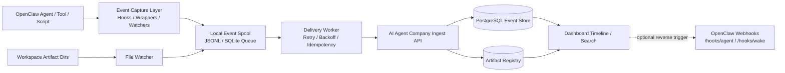
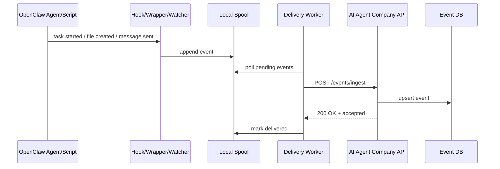

# AI Agent Company × OpenClaw 高度整合 — 開發計劃書

*版本：v1.0 Draft*  
*日期：2026-03-19*  
*作者：A2*  
*狀態：草稿，待 Eric 確認*

---

## 1. 背景與目標

### 項目背景
Eric 希望將 OpenClaw Agent 日常工作，同同機 Docker 上運行嘅 **AI Agent Company** 平台做高度整合，令平台成為統一嘅「任務紀錄 + 產出歸檔 + 查核追蹤」中心。

目前痛點係：
- Agent 做完任務後，**經常冇將紀錄寫入平台**
- 生成圖片、Social Media 文案、音訊、報告等產出，**散落喺檔案系統或聊天紀錄**，難以集中檢索
- 記錄動作依賴 Agent 自己「記得做」，**穩定性不足**
- 任務失敗 / timeout / 中斷時，**通常最容易漏記錄**

### 核心問題
依家嘅架構將「記錄責任」放喺 Agent prompt / workflow 層，屬於**不可靠設計**。應改為：

> **由系統層自動捕捉事件，再透過 Hook / Webhook 寫入 AI Agent Company。**

### 目標
建立一套 **Event-driven Logging Architecture**，令以下資料唔再靠 Agent 主動記錄：
- 任務建立、開始、進度、完成、失敗
- Agent 執行紀錄
- 生成內容（圖片、文案、音訊、報告等）
- 對外發送 / 發佈行為（WhatsApp、Discord、Social post）
- 關聯檔案 / artifacts metadata

### 成功指標（KPI）
1. **90%+ 任務** 自動產生完整 run log（唔靠 prompt）
2. **95%+ 生成 artifacts** 於 30 秒內入平台
3. webhook 失敗時，**100% 經 retry queue 保留事件**，唔即時丟失
4. 可於 AI Agent Company 根據 `task_id / run_id / project / agent` 搜尋歷史紀錄
5. 平台可顯示最少以下 timeline：
   - task created
   - task started
   - artifact created
   - message sent
   - task completed / failed

---

## 2. 需求摘要

### 功能需求

#### P0 — 必須
1. **任務事件自動記錄**
   - task.created
   - task.started
   - task.progress
   - task.completed
   - task.failed
2. **Artifact 自動記錄**
   - 圖片
   - social media draft
   - audio / TTS
   - PDF / DOCX / 報告
   - 其他輸出文件 metadata
3. **Webhook 傳送機制**
   - 將事件 POST 去 AI Agent Company ingest API
4. **本地 Queue / Spool**
   - 平台暫時 offline / timeout 時唔會漏 event
5. **Retry + Idempotency**
   - 防止重複入庫 / 漏寫
6. **基礎 Dashboard 可見性**
   - 可按任務 / run 查看 timeline

#### P1 — 應該
1. **Message send logging**
   - WhatsApp / Discord / Telegram outbound 記錄
2. **Artifact file watcher**
   - 偵測指定資料夾新增文件，自動補記錄
3. **Reconciliation job（補漏機制）**
   - 比對本地 spool、workspace 文件與平台紀錄，補回缺漏
4. **Project / Agent / Channel 關聯索引**

#### P2 — 可以
1. **全文搜尋 / 向量檢索**（搜索文案、報告、caption）
2. **Artifact 預覽頁**（縮圖 / audio player / rich preview）
3. **Cross-system trigger**
   - AI Agent Company 反向呼叫 OpenClaw webhook 啟動任務
4. **審批工作流**
   - Social content 先審批後發佈

### 非功能需求
- **可靠性：** webhook 失敗不可導致任務主流程失敗
- **可觀測性：** 每個 event 有 event_id / run_id / task_id
- **安全性：** webhook 需 token 驗證，內網優先
- **低耦合：** 記錄層不可綁死單一 agent prompt
- **可回補：** 即使平台短暫 down，都可補寫
- **可擴展：** 後續可加更多 event types

### 明確排除項
- 本階段**唔做** AI Agent Company 全面重構
- 本階段**唔做** 所有 binary 檔案直接存入 DB
- 本階段**唔做** 社交平台正式發佈 API 整合（只做 logging / archive）
- 本階段**唔做** 完整權限系統 overhaul

### [待確認] 事項清單
1. AI Agent Company 目前技術棧（前端 / backend / DB）係咩？
2. 現時有冇現成 API 可收 event？
3. 3100 係公開 port 定 docker internal service？
4. 平台想記錄 **metadata only** 定連 binary/object storage 一齊管理？
5. 目前 task / project / agent 喺平台上有冇既定 schema？
6. webhook 認證偏好：Bearer token / HMAC / internal network only？
7. 是否需要將歷史資料回填到平台？

---

## 3. 系統架構

### 推薦方案（明確建議）

**推薦採用：**

> **OpenClaw Hook + Local Event Spool + AI Agent Company Ingest API**

即：
1. 喺 OpenClaw Gateway / workspace 層用 **Hooks** 捕捉事件
2. 事件先寫入本地 **spool queue**（JSONL / sqlite / file queue）
3. 由 background worker 非同步 POST 去 **AI Agent Company webhook / ingest API**
4. AI Agent Company 負責入庫、索引、顯示、查詢
5. 額外用 **artifact watcher** 補捉漏網文件

### 點解推薦呢條路
- 唔靠 agent 記性，**穩定性高**
- webhook 失敗時仍有本地 queue，**唔會即時漏數據**
- OpenClaw hook 天生 event-driven，**適合做系統層紀錄**
- 可逐步 rollout，**唔使一次過大改所有 agent / skill**
- 日後 AI Agent Company 如要反向觸發 OpenClaw，亦可用 OpenClaw `/hooks/agent` / `/hooks/wake`

### 架構圖（Mermaid）



### 與現有 OpenClaw 能力對應
根據本地 OpenClaw docs：
- **Hooks** 適合做 event-driven automation（例如 `message:received`, `message:sent`, `gateway:startup` 等）
- **Webhooks** 主要係畀外部系統觸發 OpenClaw

所以今次整合嘅角色分工應為：
- **OpenClaw Hooks = 出口（捕捉事件）**
- **AI Agent Company Webhook / Ingest API = 收口（收 event）**
- **OpenClaw Webhooks = 日後反向觸發用途（非今次核心）**

### 技術選型建議

| 層 | 推薦技術 | 理由 |
|---|---|---|
| Event capture | OpenClaw custom hooks + wrapper scripts | 最貼近事件來源，低改動 |
| Local queue | SQLite 或 JSONL spool | 快速落地、容易 debug |
| Delivery worker | Node.js / Python 常駐 worker | 易處理 retry/backoff |
| Ingest API | Node.js (Fastify/Hono/Express) | 同 Docker 平台整合容易 |
| DB | PostgreSQL | 適合 event log + 索引 |
| Artifact storage | 先存 path + metadata，binary 保持原位 | MVP 最穩，減少大改 |

### 同現有系統關係

#### OpenClaw 端
- 透過 custom hooks 捕捉 message / lifecycle / run events
- 透過 wrapper scripts 捕捉圖片生成、social content 產出、報告輸出
- 透過 watcher 偵測 `data/projects/` 等資料夾新增 artifacts

#### AI Agent Company 端
- 提供 ingest API 接收 event
- 將 event 關聯到 task / project / agent / channel
- 顯示 timeline、artifact list、run summary

### 第三方 / 內部依賴
- OpenClaw hooks 機制
- AI Agent Company backend API
- Docker internal network
- PostgreSQL（如平台已存在則沿用）
- 本地檔案系統 / workspace

---

## 4. 數據設計

### 4.1 核心 Entity

#### `tasks`
| 欄位 | 類型 | 說明 |
|---|---|---|
| id | uuid / text | task 唯一 ID |
| project_key | text | project slug |
| title | text | 任務標題 |
| source | text | 來源（whatsapp / discord / internal） |
| status | text | pending / running / done / failed |
| created_at | timestamptz | 建立時間 |
| updated_at | timestamptz | 更新時間 |

#### `runs`
| 欄位 | 類型 | 說明 |
|---|---|---|
| id | uuid / text | run 唯一 ID |
| task_id | text | 對應 task |
| agent_id | text | b03 / ceo / marketer 等 |
| session_key | text | OpenClaw session key |
| status | text | running / completed / failed |
| started_at | timestamptz | 開始時間 |
| ended_at | timestamptz | 結束時間 |
| summary | text | run 摘要 |

#### `events`
| 欄位 | 類型 | 說明 |
|---|---|---|
| id | uuid / text | event_id，需 idempotent |
| run_id | text | 對應 run |
| task_id | text | 對應 task |
| event_type | text | task.started / artifact.created 等 |
| payload | jsonb | 詳細資料 |
| source | text | hook / wrapper / watcher |
| occurred_at | timestamptz | 事件時間 |
| received_at | timestamptz | 平台入庫時間 |

#### `artifacts`
| 欄位 | 類型 | 說明 |
|---|---|---|
| id | uuid / text | artifact_id |
| task_id | text | 關聯 task |
| run_id | text | 關聯 run |
| type | text | image / text / audio / pdf / docx |
| file_path | text | workspace path |
| file_url | text | 如有公開/內網 URL |
| mime_type | text | 檔案類型 |
| title | text | 顯示名稱 |
| preview_text | text | 預覽摘要 |
| metadata | jsonb | 額外 metadata |
| created_at | timestamptz | 建立時間 |

### 4.2 建議 Event Types

#### Task lifecycle
- `task.created`
- `task.started`
- `task.progress`
- `task.completed`
- `task.failed`

#### Run / Agent
- `run.started`
- `run.step`
- `run.completed`
- `run.failed`

#### Artifact
- `artifact.created`
- `artifact.updated`
- `artifact.linked`

#### Messaging / Delivery
- `message.sent`
- `message.failed`
- `post.published`
- `post.publish_failed`

#### System
- `gateway.startup`
- `reconcile.detected_gap`
- `reconcile.recovered_event`

### 4.3 API 設計（AI Agent Company）

#### 推薦最小 API

| Method | Path | 說明 |
|---|---|---|
| POST | `/api/v1/events/ingest` | 單個或批量收事件 |
| POST | `/api/v1/artifacts` | 建立 / 更新 artifact metadata |
| POST | `/api/v1/tasks/upsert` | task 建立或更新 |
| POST | `/api/v1/runs/upsert` | run 建立或更新 |
| GET | `/api/v1/tasks/:id/timeline` | 查看任務時間線 |
| GET | `/api/v1/artifacts` | 搜尋 artifacts |
| POST | `/api/v1/reconcile/report` | 補漏報告 |

### 4.4 建議 Ingest Payload

```json
{
  "event_id": "evt_20260319_0001",
  "event_type": "artifact.created",
  "task_id": "task_virtual_company_001",
  "run_id": "run_b03_001",
  "agent_id": "b03",
  "project": "virtual-ai-company",
  "source": "watcher",
  "occurred_at": "2026-03-19T18:40:00+08:00",
  "payload": {
    "artifact_type": "image",
    "file_path": "/home/openclaw/.openclaw/workspace/data/projects/virtual-ai-company/assets/poster-01.png",
    "title": "IG poster draft",
    "preview_text": "Spring promo poster generated"
  }
}
```

### 4.5 數據流向



---

## 5. 分階段 Roadmap

### Phase 0: 現況盤點 + POC（2-3 日）

**目標：** 先確認 AI Agent Company 現況與 OpenClaw hook 接入點，做最小可行驗證。

**工作項目：**
1. 盤點 AI Agent Company backend / DB / docker service name
2. 盤點現有任務來源（WhatsApp、Discord、sub-agent、script）
3. 設計 event schema v1
4. 實作最小 ingest endpoint（先收 JSON，寫 log / DB）
5. 實作一個 OpenClaw custom hook POC（例如 `message:sent`）
6. 驗證 docker 內網連線（用 service name，唔經公網 IP）

**Deliverables：**
- 架構確認文件
- event schema v1
- `/api/v1/events/ingest` POC
- 1 個成功寫入平台嘅測試 event

**驗收標準：**
- OpenClaw 可由同機 Docker 內網成功 POST event 去平台
- 平台可成功顯示 1 條 event log
- 不依賴 agent prompt，即可產生記錄

---

### Phase 1: 核心 Logging MVP（5-7 日）

**目標：** 完成最重要任務 / run / artifact 自動記錄。

**工作項目：**
1. 建立 local spool queue
2. 建立 delivery worker（retry / backoff / dead-letter）
3. 接入以下事件：
   - `task.created`
   - `task.started`
   - `task.completed`
   - `task.failed`
   - `artifact.created`
4. 為常見輸出腳本加 wrapper：
   - 圖片生成
   - social caption 生成
   - 報告輸出
   - TTS / audio 輸出
5. 平台建立 task timeline 頁
6. 加入 idempotency key 驗證

**Deliverables：**
- 可運行 spool + worker
- task / run / artifact 三大核心表
- timeline MVP UI
- 4 類輸出 wrapper

**驗收標準：**
- 連續 20 個測試任務中，≥18 個有完整記錄
- webhook timeout 唔會令主任務失敗
- retry 後重送唔會產生重複事件

---

### Phase 2: 覆蓋率提升 + 補漏（4-6 日）

**目標：** 解決「Agent 做咗但冇記」嘅尾巴問題。

**工作項目：**
1. 建立 file watcher 監察以下位置：
   - `data/projects/**`
   - 生成圖片目錄
   - audio / report output 目錄
2. 加入 `message.sent` / `message.failed` 記錄
3. 建立 reconciliation job：
   - 掃 workspace 新檔案
   - 對比平台紀錄
   - 自動補寫缺失 event
4. 建立 missing log alert
5. 增加 dashboard filter（project / agent / date / type）

**Deliverables：**
- file watcher
- reconcile job
- message delivery log
- 補漏報表

**驗收標準：**
- 漏記率下降至 < 10%
- 平台可查任務對應輸出檔案
- 對外發送訊息可見 send status

---

### Phase 3: 正式版 + 反向整合（5-7 日）

**目標：** 令 AI Agent Company 成為真正控制台，而唔止係 log viewer。

**工作項目：**
1. 平台加入 run summary / artifact preview
2. 加入 manual re-send / re-ingest 按鈕
3. 規劃 AI Agent Company → OpenClaw 反向觸發：
   - `/hooks/agent`
   - `/hooks/wake`
4. 加入審計頁與失敗佇列頁
5. 補文檔 / 操作手冊 / troubleshooting

**Deliverables：**
- 正式版 dashboard
- 反向 trigger 設計
- 操作文檔
- 失敗事件管理頁

**驗收標準：**
- 可於平台手動重送失敗事件
- 平台可選擇性觸發 OpenClaw agent run
- 技術文件足夠交接與維護

---

## 6. 風險與 Fallback

| 風險 | 影響 | 概率 | Fallback |
|------|------|------|----------|
| AI Agent Company API 未穩定或未定 schema | 高 | 高 | Phase 0 先做最小 ingest，先收 raw event JSON，再逐步正規化 |
| 3100 對外或容器網路不穩，經常 timeout | 高 | 中 | 改用 docker internal service name，避免走公網 IP |
| Hook 覆蓋唔到所有 artifact 產生路徑 | 中 | 高 | 加 wrapper scripts + file watcher 雙保險 |
| webhook 發送失敗導致漏資料 | 高 | 中 | 引入 local spool + retry + dead-letter queue |
| 事件重送造成重複入庫 | 中 | 中 | 每個 event 使用唯一 event_id，平台 upsert / ignore duplicate |
| 高頻事件太多，平台 DB 壓力增加 | 中 | 中 | Phase 1 先記 P0 event；高頻 step log 做抽樣或 batch ingest |
| binary file 太大，直接入平台成本高 | 中 | 中 | MVP 只記 metadata + path；正式版再評估 object storage |
| 權限 / 敏感資料外洩風險 | 高 | 中 | webhook token + internal network + payload redact + 最少權限 |

---

## 7. 驗收標準

### 功能驗收
- [ ] 建立任務時，自動產生 `task.created`
- [ ] 任務開始時，自動產生 `task.started`
- [ ] 任務完成 / 失敗時，自動產生對應 event
- [ ] 生成圖片 / 報告 / 音訊後，自動建立 `artifact.created`
- [ ] 平台可顯示某個 task 嘅完整 timeline
- [ ] 平台可按 agent / project 搜尋紀錄
- [ ] webhook fail 時事件會保留於 queue，稍後重送

### 性能驗收
- ingest API P95 response time < 500ms（metadata event）
- local spool append < 50ms
- artifact metadata 入平台時間 < 30 秒
- retry worker 喺平台恢復後 5 分鐘內清空 backlog（100 筆以內）

### 安全驗收
- webhook 必須 Bearer token 或等級相當認證
- docker internal network 優先，不經公開 internet
- payload 不包含明文 secrets / password
- 支援 event source audit（可追查邊個 hook / worker 發送）

### 文檔驗收
- 有 event schema 文檔
- 有 API 文檔
- 有 hook / worker 部署說明
- 有 troubleshooting 文檔（timeout / duplicate / missing event）

---

## 8. 實作建議（落地層面）

### 8.1 OpenClaw 端建議做法

#### A. Hooks（系統事件）
優先考慮捕捉：
- `message:sent`
- `message:received`（如需要）
- `gateway:startup`

#### B. Wrappers（輸出行為）
對高價值輸出統一包裝：
- `generate_image_with_log.sh`
- `generate_social_with_log.sh`
- `generate_report_with_log.sh`
- `generate_tts_with_log.sh`

Wrapper 流程：
1. emit `task.started`
2. run 原腳本
3. 如產生檔案 → emit `artifact.created`
4. success → emit `task.completed`
5. fail → emit `task.failed`

#### C. Watchers（補漏）
監察：
- `data/projects/`
- image output dir
- audio output dir
- report output dir

### 8.2 AI Agent Company 端建議做法
- 先提供一個 **generic ingest API**
- 第一期 raw event 全收，之後再做 normalize
- timeline UI 先做簡單版（時間、類型、摘要、連結）
- artifact preview 先顯示 metadata + 檔案路徑

### 8.3 推薦實作順序
1. Ingest API
2. Local spool
3. 一個 Hook POC
4. 一個 wrapper POC
5. Timeline 頁
6. File watcher
7. Reconciliation

---

## 9. 建議檔案 / 模組結構

```text
openclaw-side/
  hooks/
    ai-agent-company-logger/
      HOOK.md
      handler.ts
  scripts/
    emit_event.py
    delivery_worker.py
    wrappers/
      generate_image_with_log.sh
      generate_social_with_log.sh
      generate_report_with_log.sh
      generate_tts_with_log.sh
  data/
    event-spool/
      pending/
      sent/
      failed/

ai-agent-company/
  apps/api/
    src/routes/events.ts
    src/routes/tasks.ts
    src/routes/artifacts.ts
  apps/web/
    src/pages/tasks/[id].tsx
    src/pages/artifacts/index.tsx
  packages/shared/
    event-schema.ts
```

---

## 10. 建議決策

### 最終推薦
**做，而且要做成系統層整合。**

**唔建議**再靠以下方法：
- prompt 叫 agent 「記得寫平台」
- 每個 skill 人手加一段紀錄邏輯但冇共用基礎設施
- 將 logging 同主任務同步耦合（webhook fail 就連主任務一齊 fail）

### 推薦架構一句總結
> **OpenClaw 負責「捕捉事件」，AI Agent Company 負責「接收、入庫、展示」，中間加本地 spool 做可靠傳輸。**

---

## 11. 附錄

### 參考資料
1. OpenClaw Hooks 文件：`docs/openclaw-docs/automation/hooks.md`
2. OpenClaw Webhooks 文件：`docs/openclaw-docs/automation/webhook.md`
3. 現有項目文件：`data/projects/virtual-ai-company/PLAN.md`

### 當前限制
- 我喺 2026-03-19 測試 `http://43.133.194.246:3100/` 時出現 timeout，**未能直接驗證現有平台 API / UI**
- 因此本文中 AI Agent Company API path、DB schema 及 service name 屬 **推薦設計**，實作前需先盤點現況

### 下一步建議
1. 先確認 AI Agent Company 現有 stack 同 docker service name
2. 決定事件 schema v1
3. 先做 `POST /api/v1/events/ingest` POC
4. 選 1 個最常見 workflow 試接（例如圖片生成或報告輸出）
5. 成功後再擴展到全部 task / artifact
